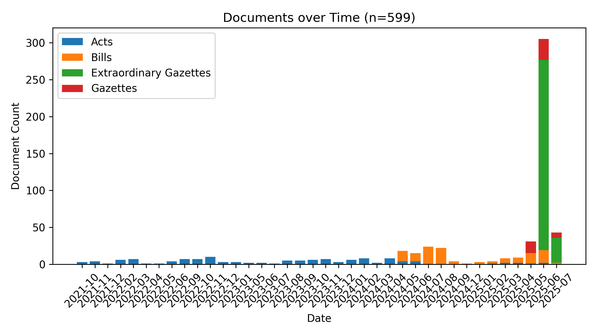

# Legal Documents - #SriLanka 🇱🇰

**599** documents (**378MB**) as of **2025-07-05 20:38:40**.

A collection of Gazettes, Extra Gazettes, Acts, Bills and more, scraped from [documents.gov.lk](https://documents.gov.lk).

🆓 **Public** data, fully open-source – fork freely!

🗣️ **Tri-Lingual** - සිංහල, தமிழ் & English

🔍 **Useful** for Journalists, Researchers, Lawyers & law students, Policy watchers & Citizens who want to stay informed

#Legal #OpenData #GovTech

## Documents

(📢 = Gazettes, 🚨 = Extra-Gazettes, 🏛️ = Acts, ✍️ = Bills)

### 2025

#### 2025-07

- ✍️ 2025-07-04 [Land Development (Amendment) - GS](data/bills/2025/617-2025) [617/2025]
- 🚨 2025-07-04 [Election Commission - Elected Chairman and Vice Chairman of 03 Local Government Institutions in Western Province](data/extra-gazettes/2025/2443-61) [2443/61]
- 🚨 2025-07-04 [Election Commission - Local Authorities Elections Ordinance (Chapter 262) Notice under Section 66(2) Elected to the Members of Biyagama, Weraketiya and Thalawa P.S](data/extra-gazettes/2025/2443-60) [2443/60]
- 🚨 2025-07-04 [Department of Local Government - Norther Province - Elected Mayor, Deputy Mayor, Chairman and Vice Chairman in the 1st Meeting of Local Authorities in Norther Province](data/extra-gazettes/2025/2443-58) [2443/58]
- 🚨 2025-07-04 [Central Bank of Sri Lanka - Appointment of an Administrator to Nation Lanka Finance PLC](data/extra-gazettes/2025/2443-57) [2443/57]
- 📢 2025-07-04 [Legal Section](data/gazettes/2025/2025-07-04-legal-section) [2025-07-04-legal-section]
- 📢 2025-07-04 [Land Section](data/gazettes/2025/2025-07-04-land-section) [2025-07-04-land-section]
- 📢 2025-07-04 [IV (A) - Provincial Councils](data/gazettes/2025/2025-07-04-iv-a-provincial-councils) [2025-07-04-iv-a-provincial-councils]
- 📢 2025-07-04 [(III) - TRADE MARKS AND PATENT NOTICES](data/gazettes/2025/2025-07-04-iii-trade-marks-and-patent-notices) [2025-07-04-iii-trade-marks-and-patent-notices]
- 📢 2025-07-04 [(IIB) - Advertising](data/gazettes/2025/2025-07-04-iib-advertising) [2025-07-04-iib-advertising]
- 📢 2025-07-04 [(IIA) - Advertising](data/gazettes/2025/2025-07-04-iia-advertising) [2025-07-04-iia-advertising]
- 📢 2025-07-04 [(I) - General](data/gazettes/2025/2025-07-04-i-general) [2025-07-04-i-general]
- ✍️ 2025-07-03 [Mediation (Civil and Commercial Disputes) - GS](data/bills/2025/616-2025) [616/2025]
- 🚨 2025-07-03 [Presidential Secretariat - Removal from BMICH Management Membership](data/extra-gazettes/2025/2443-56) [2443/56]
- 🚨 2025-07-03 [Land Acquisition - Hunukumbura, Bamunukotuwa D/S Division Hunupitiya - Udukumbura Road - Sec.33](data/extra-gazettes/2025/2443-55) [2443/55]
- 🚨 2025-07-03 [Ministry of Urban Development, Construction and Housing - National Water Supply and Drainage Board Act, No 02 of1974 Order under Section 92 Keppitipola Water Treatment Plant](data/extra-gazettes/2025/2443-54) [2443/54]
- 🚨 2025-07-03 [Ministry of Urban Development, Construction and Housing - National Water Supply and Drainage Board Act, No 02 of1974 Order under Section 92](data/extra-gazettes/2025/2443-53) [2443/53]
- 🚨 2025-07-03 [Land Acquisition - Welpalla, Pannala D/S Division in Kurunegala District , Badabedda East, Pannala D/S Division in Kurunegala District- Sec.05](data/extra-gazettes/2025/2443-52) [2443/52]
- 🚨 2025-07-03 [Department of Local Government - UVA Province - Appointed Mayor, Deputy Mayor, Chairman and Vice Chairman for 12 Local Government Institutions](data/extra-gazettes/2025/2443-51) [2443/51]
- 🚨 2025-07-03 [Election Commission - Parliamentary Elections Act. No 01 of 1981 Filling of a Vacancy under Section 64 (5)](data/extra-gazettes/2025/2443-50) [2443/50]
- 🚨 2025-07-02 [Land Title Settlement Dept. - Hiththetiya, Matara D/S Division, Matara District (25/0059)](data/extra-gazettes/2025/2443-48) [2443/48]
- 🚨 2025-07-02 [Land Title Settlement Dept. - Piliwelagama, Udapalatha D/S Division, Kandy District (25/0117)](data/extra-gazettes/2025/2443-47) [2443/47]
- 🚨 2025-07-02 [Land Title Settlement Dept. - Watinapana, Minuwangoda D/S Division, Gampaha District (25/0122)](data/extra-gazettes/2025/2443-46) [2443/46]
- 🚨 2025-07-02 [Land Title Settlement Dept. - Wennappuwa, Wennappuwa D/S Division, Puttalam District (25/0082)](data/extra-gazettes/2025/2443-45) [2443/45]
- 🚨 2025-07-02 [Land Title Settlement Dept. - Thalatiriyagama, Galewela D/S Division, Matale District (25/0087)](data/extra-gazettes/2025/2443-44) [2443/44]
- 🚨 2025-07-02 [Land Title Settlement Dept. - Mailawalana, Dompe D/S Division, Gampaha District (25/0154)](data/extra-gazettes/2025/2443-43) [2443/43]
- 🚨 2025-07-02 [Land Title Settlement Dept. - Porapola, Kurunegala D/S Division, Kurunegala District (7830)](data/extra-gazettes/2025/2443-42) [2443/42]
- 🚨 2025-07-02 [Department of Fiscal policy - Inland Revenue Act, No. 24 of 2017 - Protocol](data/extra-gazettes/2025/2443-41) [2443/41]
- 🚨 2025-07-02 [Land Title Settlement Dept. - Kotakadeniya, Udapalatha D/S Division, Kandy District (25/0268)](data/extra-gazettes/2025/2443-40) [2443/40]
- 🚨 2025-07-02 [Land Title Settlement Dept. - Nelumvila, Thamankaduwa D/S Division, Polonnaruwa District (25/0213)](data/extra-gazettes/2025/2443-39) [2443/39]
- 🚨 2025-07-02 [Land Title Settlement Dept. - Gampolawela, Ganga Ihala Korale D/S Division, Kandy District (25/0209)](data/extra-gazettes/2025/2443-38) [2443/38]
- 🚨 2025-07-02 [Land Title Settlement Dept. - Aluthgama, Bogamuwa D/S Division, Gampaha District (25/0165)](data/extra-gazettes/2025/2443-37) [2443/37]
- 🚨 2025-07-02 [Land Title Settlement Dept. - 2 nd Step Anuradhapura, Nuwaragampalatha East D/S Division, Anuradhapura District (25/1200063)](data/extra-gazettes/2025/2443-36) [2443/36]
- 🚨 2025-07-02 [Land Title Settlement Dept. - Hindagal (Block 06), Kandy Four Gravets and Gangawata Korale D/S Division, Kandy District (25/1200062)](data/extra-gazettes/2025/2443-35) [2443/35]
- 🚨 2025-07-01 [Inland Revenue Department Value Added Tax Act, No. 14 of 2022 Procedure for Collecting and paying VAT](data/extra-gazettes/2025/2443-30) [2443/30]
- 🚨 2025-07-01 [Dept. of Local Government Western Province - Notification Made under Section 66 (1) Recall of first Meeting of 04 Local Government Institutions](data/extra-gazettes/2025/2443-28) [2443/28]
- 🚨 2025-07-01 [Ministry of Health - Food Act,No. 26 of 1980 Amended the food (Labelling and Advertising Regulations 2022)](data/extra-gazettes/2025/2443-27) [2443/27]
- 🚨 2025-07-01 [Land Title Settlement Dept. - Kudamaduwa, Homagama D/S Division, Colombo District (25/551408)](data/extra-gazettes/2025/2443-26) [2443/26]
- 🚨 2025-07-01 [Land Title Settlement Dept. - Thudella South, Ja-Ela D/S Division, Gampaha District (25/1033)](data/extra-gazettes/2025/2443-25) [2443/25]
- 🚨 2025-07-01 [Land Title Settlement Dept. - Ballapana Udabage, Galigamuwa D/S Division, Kegalle District (25/55034)](data/extra-gazettes/2025/2443-24) [2443/24]
- 🚨 2025-07-01 [Land Title Settlement Dept. - Wataddara, Attanagalla D/S Division, Gampaha District (25/5514085)](data/extra-gazettes/2025/2443-23) [2443/23]
- 🚨 2025-07-01 [Dept of Fiscal Policy The Inland Revenue Act, No. 24 of 2017 J. L. Sirisena Memorial Elders Home of Bingiriya Social Service Association](data/extra-gazettes/2025/2443-22) [2443/22]
- 🚨 2025-07-01 [Dept of Local Government N W P - Appointed Chairman and Vice Chairman for 03 Local Government Institutions](data/extra-gazettes/2025/2443-21) [2443/21]

#### 2025-06

- 🚨 2025-06-30 [Department of Labour - The Wages Boards Ordinance, (Chapter 136) Special Allowance payable to workers](data/extra-gazettes/2025/2443-20) [2443/20]
- 🚨 2025-06-30 [Land Title Settlement Dept. - Thimbirigama, Dompe D/S Division, Gampaha District (25/5514111)](data/extra-gazettes/2025/2443-19) [2443/19]
- 🚨 2025-06-30 [2443/15](data/extra-gazettes/2025/2443-15) [2443/15]
- 🚨 2025-06-30 [Public Debt Management Office- Public Debt Management Act, No. 33 of 2024. Public Debt Management Regulations No. 01 of 2025](data/extra-gazettes/2025/2443-14) [2443/14]
- 🚨 2025-06-30 [National Physical Planning Department - The Town and Country Planning Ordinance (Chapter 269) Declare that the Land called "Sankapitti Purana Vihara area as an Urban Development Area](data/extra-gazettes/2025/2443-10) [2443/10]
- 🚨 2025-06-30 [Ministry of Health - Food Act, No.26 of 1980 Amended the Food (Iodization of Salt) Regulation 2023.](data/extra-gazettes/2025/2443-09) [2443/09]
- 🚨 2025-06-30 [Ministry of Health - Food Act, No.26 of 1980 Amended the Food (Colour Coding for Suger Levels liquid) Regulation 2022.](data/extra-gazettes/2025/2443-08) [2443/08]
- 🚨 2025-06-30 [Ministry of Health - Food Act, No.26 of 1980 Amended the Food (Frans - Fat) Regulation 2022.](data/extra-gazettes/2025/2443-07) [2443/07]
- 🚨 2025-06-30 [Ministry of Health - Food Act, No.26 of 1980 Amended the Food (labelling and Advertising) Regulations 2023.](data/extra-gazettes/2025/2443-06) [2443/06]
- 🚨 2025-06-30 [Sri Lanka Customs - Rate Of Exchange with Effect from 30.06.2025 to 06.07.2025](data/extra-gazettes/2025/2443-01) [2443/01]
- 🚨 2025-06-28 [Dept. of Local Government - Eastern Province - Notice under section 66 (c) Appointed Vice Chairman Kantale Pradeshiya Sabha](data/extra-gazettes/2025/2442-79) [2442/79]
- 🚨 2025-06-28 [Land Title Settlement Dept. - Lewla, kandy four Gravetd and Gangawata Korale D/S Division, Kandy District - (25/0138)](data/extra-gazettes/2025/2442-70) [2442/70]
- 🚨 2025-06-28 [Land Title Settlement Dept. - Waligalla, Udunuwara D/S Division, Kandy District - (25/0162)](data/extra-gazettes/2025/2442-69) [2442/69]
- 🚨 2025-06-28 [Land Title Settlement Dept. - Kalalpitiya, Attanagalla D/S Division, Gampaha District - (25/0130)](data/extra-gazettes/2025/2442-68) [2442/68]
- 🚨 2025-06-28 [Land Title Settlement Dept. - Holambalewa, Kobeigane D/S Division, Kurunegala District - (24-14-4-00021)](data/extra-gazettes/2025/2442-67) [2442/67]
- 🚨 2025-06-28 [Land Title Settlement Dept. - Paluwewa, Hingurakgoda  D/S Division, Polonnaruwa District (25/0070)](data/extra-gazettes/2025/2442-66) [2442/66]
- 🚨 2025-06-28 [Land Aquisition - Mathugobe (Deniyaya), Kotapola D/S Division, Matara District, Land Aquisition - Corrigenda Kandy Four Gravets Gangawata Korale D/S Division, District, Sec 07](data/extra-gazettes/2025/2442-65) [2442/65]
- 🚨 2025-06-28 [Ministry of Labour - Industrial Dispute between Mr. P. A. G. Wijebanda and Transport Service Authority.](data/extra-gazettes/2025/2442-64) [2442/64]
- 🚨 2025-06-28 [Ministry of Labour - Industrial Dispute between Mr. P. M. Jayarathna Sri Lanka Transport Board.  Appt. of J. De Silva as an Arbitrator., Sri Lanka Nidahas Sevaka Sangama & Packserve Pvt. Ltd. Industrial Dispute between Mr. M. N. Abeykoon and Sri Lanka Transport Board.](data/extra-gazettes/2025/2442-63) [2442/63]
- 🚨 2025-06-27 [Presidential Secretariat - Call out All the Members of the Armed Forces with effect from 27th June, 2025](data/extra-gazettes/2025/2442-62) [2442/62]
- 🚨 2025-06-27 [Department of The Local Government N.C.P - Appointed Chairman and Vice Chairman for the Anuradgapura Local Authorities 2025](data/extra-gazettes/2025/2442-61) [2442/61]
- 🚨 2025-06-27 [Election Commission - Local Autherities Elections- 2025 Notice Under Section 66 (2) Elected to members of 36 Local Governments Institutions](data/extra-gazettes/2025/2442-60) [2442/60]
- 🚨 2025-06-27 [Land Aquisition - Maharagama, Homagama D/S Division, Colombo District, Land Aquisition - Homagama, Homagama D/S Division, Colombo District, Sec 05](data/extra-gazettes/2025/2442-59) [2442/59]
- 🚨 2025-06-27 [Land Aquisition - Homagama, Homagama D/S Division, Colombo District, Land Aquisition - Maharagama, Homagama D/S Division, Colombo District, Sec 05](data/extra-gazettes/2025/2442-58) [2442/58]
- 🚨 2025-06-27 [Dept. of Local Government - Western Province Appointed Mayor, Deputy Mayor  Chairman and Vice Chairman for Local Government Institutions](data/extra-gazettes/2025/2442-57) [2442/57]
- 📢 2025-06-27 [List of Jurors](data/gazettes/2025/2025-06-27-list-of-jurors) [2025-06-27-list-of-jurors]
- 📢 2025-06-27 [Legal Section](data/gazettes/2025/2025-06-27-legal-section) [2025-06-27-legal-section]
- 📢 2025-06-27 [Land Section](data/gazettes/2025/2025-06-27-land-section) [2025-06-27-land-section]
- 📢 2025-06-27 [IV (B) - Local Government](data/gazettes/2025/2025-06-27-iv-b-local-government) [2025-06-27-iv-b-local-government]
- 📢 2025-06-27 [IV (A) - Provincial Councils](data/gazettes/2025/2025-06-27-iv-a-provincial-councils) [2025-06-27-iv-a-provincial-councils]
- 📢 2025-06-27 [(III) - TRADE MARKS AND PATENT NOTICES](data/gazettes/2025/2025-06-27-iii-trade-marks-and-patent-notices) [2025-06-27-iii-trade-marks-and-patent-notices]
- 📢 2025-06-27 [(IIB) - Advertising](data/gazettes/2025/2025-06-27-iib-advertising) [2025-06-27-iib-advertising]
- 📢 2025-06-27 [(IIA) - Advertising](data/gazettes/2025/2025-06-27-iia-advertising) [2025-06-27-iia-advertising]
- 📢 2025-06-27 [(I) - General](data/gazettes/2025/2025-06-27-i-general) [2025-06-27-i-general]
- 🚨 2025-06-26 [Land Aquisition - Malabe, Kaduwela D/S Division, Colombo District - Sec.05](data/extra-gazettes/2025/2442-56) [2442/56]
- 🚨 2025-06-26 [Land Title Settlement Dept. - kalawanegama, Ginipendegama  D/S Division, Kurunegala District (25/0038)](data/extra-gazettes/2025/2442-55) [2442/55]
- 🚨 2025-06-26 [Land Title Settlement Dept. - Naththandiya, Naththandiya  D/S Division, Puttalam District (25/0081)](data/extra-gazettes/2025/2442-54) [2442/54]
- 🚨 2025-06-26 [Land Title Settlement Dept. - Pathagama, Kuruvita  D/S Division, Ratnapura District (25/0133)](data/extra-gazettes/2025/2442-53) [2442/53]
- 🚨 2025-06-26 [Land Title Settlement Dept. - Kalupedigama, Balangoda  D/S Division, Ratnapura District (25/0157)](data/extra-gazettes/2025/2442-52) [2442/52]
- 🚨 2025-06-26 [Land Title Settlement Dept. - Homagama, Homagama D/S Division, Colombo District (25/0179)](data/extra-gazettes/2025/2442-51) [2442/51]
- 🚨 2025-06-26 [Land Title Settlement Dept. - Waththala, Watttala D/S Division, Gampaha District (25/0225)](data/extra-gazettes/2025/2442-50) [2442/50]
- 🚨 2025-06-26 [Divisional Secretatiat Kamburupitiya Pilgrmages Ordinance (Chapter 175) Annual Esala Festival 2025 of Ilangamgoda Ancient Rajamaha Viharaya, Sapugoda Kaburupitiya](data/extra-gazettes/2025/2442-49) [2442/49]
- 🚨 2025-06-26 [Land Title Settlement Dept. - Ellakkala, Attanagalla D/S Division, Gampaha District (25/0189)](data/extra-gazettes/2025/2442-48) [2442/48]
- 🚨 2025-06-26 [Dept of Local Government Sabaragamuwa Province - Appointed Chairman and Vice Chairman for 02 Local Government Institutions](data/extra-gazettes/2025/2442-47) [2442/47]
- 🚨 2025-06-26 [Dept. of Local Government - N. W. P - Notice under section 66 (c) Appointed Chairman, Vice Chairman, Mayor and Deputy Mayor for 14 Local Government Institutions.](data/extra-gazettes/2025/2442-46) [2442/46]
- 🚨 2025-06-26 [Dept of Local Government Sabaragamuwa Province - Appointed Chairman and Vice Chairman to the 04 Local Government Institutions](data/extra-gazettes/2025/2442-45) [2442/45]
- 🚨 2025-06-24 [Land Title Settlement Dept. - Suriyapaluwa, Mahara D/S Division, Gampaha District (25/0075)](data/extra-gazettes/2025/2442-44) [2442/44]
- 🚨 2025-06-24 [Land Title Settlement Dept. - Atanikitha, Imaduwa D/S Division, Galle District (25/0184)](data/extra-gazettes/2025/2442-43) [2442/43]
- 🚨 2025-06-24 [Land Title Settlement Dept. - Atanikitha, Imaduwa D/S Division, Galle District (25/0184)](data/extra-gazettes/2025/2442-42) [2442/42]
- 🚨 2025-06-24 [Land Title Settlement Dept. - Weeravila New Town, Lunugamvehera D/S Division, Hambantota District (25/0204)](data/extra-gazettes/2025/2442-41) [2442/41]
- 🚨 2025-06-24 [Land Title Settlement Dept. - Gangodavila, Sri Jayawardanapura Kotte D/S Division, Colombo District (25/0029)](data/extra-gazettes/2025/2442-40) [2442/40]
- 🚨 2025-06-24 [Land Title Settlement Dept. - Meegastenna, Rideegama D/S Division, Kurunegala District (25/0013)](data/extra-gazettes/2025/2442-39) [2442/39]
- 🚨 2025-06-24 [Land Title Settlement Dept. - Siyambalanduwa, Siyambalanduwa D/S Division, Monaragala District (25/0100)](data/extra-gazettes/2025/2442-38) [2442/38]
- 🚨 2025-06-24 [Land Title Settlement Dept. - Pahalaglostorwatta, Doluwa D/S Division, Kandy District (25/0146)](data/extra-gazettes/2025/2442-37) [2442/37]
- 🚨 2025-06-24 [Land Title Settlement Dept. - Dediyawala, Kalutara D/S Division, Kalutara District (25/0161)](data/extra-gazettes/2025/2442-36) [2442/36]
- 🚨 2025-06-24 [Land Title Settlement Dept. - Wennappuwa, Wennappuwa D/S Division, Puttalam District (25/0152)](data/extra-gazettes/2025/2442-35) [2442/35]
- 🚨 2025-06-24 [Land Title Settlement Dept. - Nelliya, Ibbagamuwa D/S Division, Kurunegala District (25/0014)](data/extra-gazettes/2025/2442-34) [2442/34]
- 🚨 2025-06-24 [Land Title Settlement Dept. - Weeravila New Town, Lunugamvehera D/S Division, Hambantota District (25/0044)](data/extra-gazettes/2025/2442-33) [2442/33]
- 🚨 2025-06-24 [Land Aquisition - Uppuweli, Town and Gravets  D/S Division, Trincomalee District.](data/extra-gazettes/2025/2442-32) [2442/32]
- 🚨 2025-06-24 [Land Aquisition - Kavudawa, Monaragala D/S Division, Monaragala District, Land Aquisition - Correction Paper Kurunegala  D/S Division, kurunegala District, Land Aquisition - Correction Paper Kurunegala  D/S Division, kurunegala District,](data/extra-gazettes/2025/2442-31) [2442/31]
- 🚨 2025-06-24 [Sri Lanka Parliament - Convening of the Parliament of the Democratic Socialist Republic of Sri Lanka on Monday, the 30th of June, 2025 at 9.30 a.m.](data/extra-gazettes/2025/2442-30) [2442/30]
- 🚨 2025-06-24 [Dept. of Census and Statistics National Consumer Price Index - May 2025](data/extra-gazettes/2025/2442-29) [2442/29]
- ✍️ 2025-06-23 [National Audit (Amendment) - GS](data/bills/2025/611-2025) [611/2025]
- 🚨 2025-06-23 [Land Title Settlement Dept. - Boralessa, Wennappuwa D/S Division, Puttalam District (25/0036)](data/extra-gazettes/2025/2442-28) [2442/28]
- 🚨 2025-06-23 [Land Title Settlement Dept. - Uyangalla, Ganewatta D/S Division, Kurunegala District (25/0055)](data/extra-gazettes/2025/2442-27) [2442/27]
- 🚨 2025-06-23 [Land Title Settlement Dept. - Paraththa, Panadura D/S Division, Kalutara District (25/0049)](data/extra-gazettes/2025/2442-26) [2442/26]
- 🚨 2025-06-23 [Land Title Settlement Dept. - Gampolawatta, Ganga Ihala Korale D/S Division, Kandy District (25/0027)](data/extra-gazettes/2025/2442-25) [2442/25]
- 🚨 2025-06-23 [Land Title Settlement Dept. - Deevilla, Yatawatta D/S Division, Matale District (24-14-4-00030)](data/extra-gazettes/2025/2442-24) [2442/24]
- 🚨 2025-06-23 [Land Title Settlement Dept. - Balagala, Wattala D/S Division, Gampaha District (24-14-4-0004)](data/extra-gazettes/2025/2442-23) [2442/23]
- 🚨 2025-06-23 [Land Title Settlement Dept. - karawadeniya, Ruwanwella D/S Division, Kegalle District (24-14-4-00018)](data/extra-gazettes/2025/2442-22) [2442/22]
- 🚨 2025-06-23 [Land Title Settlement Dept. - Kadawedduwa, Devinuwara D/S Division, Matara District 24-14-4-00012)](data/extra-gazettes/2025/2442-21) [2442/21]
- 🚨 2025-06-23 [Land Title Settlement Dept. - Moratuwela, Yatawaththa D/S Division, Matale District (24-4-4-00057)](data/extra-gazettes/2025/2442-20) [2442/20]
- 🚨 2025-06-23 [Land Title Settlement Dept. - Enamaluwa, Dambulla D/S Division, Matale District (25/0057)](data/extra-gazettes/2025/2442-19) [2442/19]
- 🚨 2025-06-23 [Land Title Settlement Dept. - Sitinamaluwa, Beliatta D/S Division, Hambantota District (25/0089)](data/extra-gazettes/2025/2442-18) [2442/18]
- 🚨 2025-06-23 [Land Title Settlement Dept. - Bakmigolla, Ibbagamuwa D/S Division, Kurunegala District (25/0137)](data/extra-gazettes/2025/2442-17) [2442/17]
- 🚨 2025-06-23 [Presidential Secretariat - Appointed Mr. K.G.P. Pushpakumara, as the Chief Secretary of the Western Province with effect from 09 the June 2025](data/extra-gazettes/2025/2442-16) [2442/16]
- 🚨 2025-06-23 [Land Title Settlement Dept. - Hapugaspitiya, Udapalatha  D/S Division, Kandy District (25/0149)](data/extra-gazettes/2025/2442-15) [2442/15]
- 🚨 2025-06-23 [Land Title Settlement Dept. - Dediyawala, Kalutara D/S Division, Kalutara District (25/0039)](data/extra-gazettes/2025/2442-14) [2442/14]
- 🚨 2025-06-23 [Land Title Settlement Dept. - Kalupedigama, Balangoda D/S Division, Ratnapura District (25/0107)](data/extra-gazettes/2025/2442-13) [2442/13]
- 🚨 2025-06-23 [Land Title Settlement Dept. - Pokunuwita, Horana D/S Division, Kalutara District (25/0069)](data/extra-gazettes/2025/2442-12) [2442/12]
- 🚨 2025-06-23 [Land Title Settlement Dept. - jakauwa, Rideegama D/S Division, Kurunegala District (25/0097)](data/extra-gazettes/2025/2442-11) [2442/11]
- 🚨 2025-06-23 [Land Title Settlement Dept. - Kolamunna, kesbewa D/S Division, Colombo District (7822)](data/extra-gazettes/2025/2442-10) [2442/10]
- 🚨 2025-06-23 [Land Title Settlement Dept. - Thabiliyana, Kuruvita D/S Division, Ratnapura District (24-14-4100007))](data/extra-gazettes/2025/2442-09) [2442/09]
- 🚨 2025-06-23 [Land Title Settlement Dept. - Suriyapaluwa, Mahara D/S Division, Gampaha District (25/5514081)](data/extra-gazettes/2025/2442-08) [2442/08]
- 🚨 2025-06-23 [Land Title Settlement Dept. - Hiththetiya East, Hiththetiya East D/S Division, Matara District (25/5514099)](data/extra-gazettes/2025/2442-07) [2442/07]
- 🚨 2025-06-23 [Land Title Settlement Dept. - Welagama, Divulapitiya D/S Division, Gampaha District (25/5514084)](data/extra-gazettes/2025/2442-06) [2442/06]
- 🚨 2025-06-23 [Land Title Settlement Dept. - Senarathgama, Harispaththuwa D/S Division, Kandy District (25/5514101)](data/extra-gazettes/2025/2442-05) [2442/05]
- 🚨 2025-06-23 [Department of Local Government - Sabaragamuwa Province - Appointed Chairman and Vice Chairman of Local Government Institution](data/extra-gazettes/2025/2442-04) [2442/04]
- 🚨 2025-06-23 [Land Title Settlement Dept. - Koralawella, Moratuwa D/S Division, Colombo District (25/5514097)](data/extra-gazettes/2025/2442-03) [2442/03]
- 🚨 2025-06-23 [Dept of Local Government - Western Province - Appointed Chairman and Vice Chairman for 06 Local Goverment Institutions - 2025](data/extra-gazettes/2025/2442-02) [2442/02]
- 🚨 2025-06-23 [Sri Lanka Customs - Rates of Exchange with effect from 23.06.2025 to 29.06.2025](data/extra-gazettes/2025/2442-01) [2442/01]
- 🚨 2025-06-21 [Land Title Settlement Dept. - Polgahaange, Udunuwara D/S Division, Kandy District (25/5514103)](data/extra-gazettes/2025/2441-79) [2441/79]
- 🚨 2025-06-21 [Land Title Settlement Dept. - Thiruvaiyare (Block 04), Karachchi D/S Division, Kilinochchi District (25/1200056)](data/extra-gazettes/2025/2441-78) [2441/78]
- 🚨 2025-06-21 [Land Title Settlement Dept. - Sinhapura (Block 02), Ganga Ihala Korale D/S Division, Kandy District (25/1200057)](data/extra-gazettes/2025/2441-77) [2441/77]
- 🚨 2025-06-21 [Land Title Settlement Dept. - Batugammana, Monaragala D/S Division, Monaragala District (25/0101)](data/extra-gazettes/2025/2441-76) [2441/76]
- 🚨 2025-06-21 [Land Title Settlement Dept. - Hiththatiya Central, Matara D/S Division, Matara District (25/0003)](data/extra-gazettes/2025/2441-75) [2441/75]
- 🚨 2025-06-21 [Land Title Settlement Dept. - Puttalam, Puttalam D/S Division, Puttalam District (25/0085)](data/extra-gazettes/2025/2441-74) [2441/74]
- 🚨 2025-06-21 [Land Title Settlement Dept. - Mailawalana, Dompe D/S Division, Gampaha District (25/0084)](data/extra-gazettes/2025/2441-73) [2441/73]
- 🚨 2025-06-21 [Land Title Settlement Dept. - Nivithigala, Nivithigala D/S Division, Ratnapura District (25/0177)](data/extra-gazettes/2025/2441-72) [2441/72]
- 🚨 2025-06-21 [Land Title Settlement Dept. - Aluthgama Bogamuwa, Gampaha D/S Division, Gampaha District (25/0060)](data/extra-gazettes/2025/2441-71) [2441/71]
- 🚨 2025-06-21 [Land Title Settlement Dept. - Kumbalpola, Kurunegala D/S Division, Kurunegala District (7825)](data/extra-gazettes/2025/2441-70) [2441/70]
- 🚨 2025-06-21 [Land Title Settlement Dept. - Diggala, Panadura D/S Division, Kalutara District - (24/1198)](data/extra-gazettes/2025/2441-69) [2441/69]
- 🚨 2025-06-21 [Land Title Settlement Dept. - Mampe, Kesbewa D/S Division, Colombo District - (25/0079)](data/extra-gazettes/2025/2441-68) [2441/68]
- 🚨 2025-06-21 [Land Title Settlement Dept. - Unagaswewa, Nuwaragampalatha East D/S Division, Anuradhapura District - (25/0125)](data/extra-gazettes/2025/2441-67) [2441/67]
- 🚨 2025-06-21 [Land Title Settlement Dept. - Kasikote, Ambanpola D/S Division, Kurunegala District - (25/0172)](data/extra-gazettes/2025/2441-66) [2441/66]
- 🚨 2025-06-21 [Land Title Settlement Dept. - Aluthnuwara, Imbulpe D/S Division, Ratnapura District - (25/0156)](data/extra-gazettes/2025/2441-65) [2441/65]
- 🚨 2025-06-21 [Land Title Settlement Dept. - Kaudana, Four Deh D/S Division, Colombo District - (7826)](data/extra-gazettes/2025/2441-64) [2441/64]
- 🚨 2025-06-21 [Land Title Settlement Dept. - Narangodapaluwa, Ja-ela D/S Division, Gampaha District - (25/0164)](data/extra-gazettes/2025/2441-63) [2441/63]
- 🚨 2025-06-21 [Land Title Settlement Dept. -Pilawala (Block 04) Bulathkohupitiya D/S Division, Kegalle District - (25/1200055)](data/extra-gazettes/2025/2441-62) [2441/62]
- 🚨 2025-06-21 [Land Title Settlement Dept. - Wattala, Wattala D/S Division, Gampaha District - (25/0163)](data/extra-gazettes/2025/2441-61) [2441/61]
- 🚨 2025-06-21 [National Physical Planning Department – The Town and Country Planning Ordinance (Chapter 269) -Declare that Land called Maha Kappina Seemamalaka Viharaya call as an Urban Development area](data/extra-gazettes/2025/2441-60) [2441/60]
- 🚨 2025-06-21 [National Physical Planning Department – The Town and Country Planning Ordinance (Chapter 269) -Declare that Land called Maha Manthinda Priven Viharaya as an Urban Development area](data/extra-gazettes/2025/2441-59) [2441/59]
- 🚨 2025-06-21 [National Physical Planning Department – The Town and Country Planning Ordinance (Chapter 269) -Declare that Land called Dickwella Deegawalukarama Rajamaha Vihara as an Urban Development area](data/extra-gazettes/2025/2441-58) [2441/58]
- 🚨 2025-06-21 [National Physical Planning Department Town and Country Planning Ordinance (Chapter 269) Declare that the Land called Purana Athkanda Rajamaha Viharaya called as an Urban Development Area](data/extra-gazettes/2025/2441-57) [2441/57]
- 🚨 2025-06-20 [Architects Registration Board Sri Lanka Institute of Architects (Amendment) Act, No. 14 of 1996- Chartered Architects, Architects, Architactural Licentiates for the Registration of Persons - 2025](data/extra-gazettes/2025/2441-56) [2441/56]
- 🚨 2025-06-20 [Election Commission - Local Authorities Election - 2025 Notice Under Section 66(2) Elected to the Members for Dehiwala - Mount Lavinia M/C Kotikawatta - Mulleriyawa P.S, Homagama P.S and Weeraketiya Pradeshiya Sabha.](data/extra-gazettes/2025/2441-55) [2441/55]
- 🚨 2025-06-20 [Land Title Settlement Dept. - Dalupitiya East, Mahara D/S Division, Gampaha District - (25/5514098)](data/extra-gazettes/2025/2441-54) [2441/54]
- 🚨 2025-06-20 [Land Title Settlement Dept. - Aluthgama Bogamuwa, Gampaha D/S Division, Gampaha District - (25/5514100)](data/extra-gazettes/2025/2441-53) [2441/53]
- 🚨 2025-06-20 [Land Title Settlement Dept. - Halpugala, Bope Poddala D/S Division, Galle District - (25/0186)](data/extra-gazettes/2025/2441-52) [2441/52]
- 🚨 2025-06-20 [Land Title Settlement Dept. - Wennappuwa, Wennappuwa D/S Division, Puttalam District - (25/55033)](data/extra-gazettes/2025/2441-51) [2441/51]
- 🚨 2025-06-20 [Land Title Settlement Dept. - Doratiyawa, Mallavapitiya D/S Division, Kurunegala District - (25/5514102)](data/extra-gazettes/2025/2441-50) [2441/50]
- 🚨 2025-06-20 [Land Title Settlement Dept. -Irabadagama, Pannala D/S Division, Kurunegala District - (25/5514096)](data/extra-gazettes/2025/2441-49) [2441/49]
- 🚨 2025-06-20 [Land Title Settlement Dept. - Horagolla, Gampaha D/S Division, Gampaha District - (25/0105)](data/extra-gazettes/2025/2441-48) [2441/48]
- 🚨 2025-06-20 [Meditation Boards Commission- Notice Calling for Nominations for the Appointments of Mediators- Gampaha District](data/extra-gazettes/2025/2441-46) [2441/46]
- 🚨 2025-06-20 [Meditation Boards Commission- Notice Calling for Nominations for the Appointments of Mediators](data/extra-gazettes/2025/2441-45) [2441/45]
- 🚨 2025-06-20 [Bibila Pradeshiya Sabha Roads and Narrow Paths - 2nd Gazette](data/extra-gazettes/2025/2441-44) [2441/44]
- 📢 2025-06-20 [Legal Section](data/gazettes/2025/2025-06-20-legal-section) [2025-06-20-legal-section]
- 📢 2025-06-20 [Land Section](data/gazettes/2025/2025-06-20-land-section) [2025-06-20-land-section]
- 📢 2025-06-20 [IV (B) - Local Government](data/gazettes/2025/2025-06-20-iv-b-local-government) [2025-06-20-iv-b-local-government]
- 📢 2025-06-20 [(III) - TRADE MARKS AND PATENT NOTICES](data/gazettes/2025/2025-06-20-iii-trade-marks-and-patent-notices) [2025-06-20-iii-trade-marks-and-patent-notices]
- 📢 2025-06-20 [(IIA) - Advertising](data/gazettes/2025/2025-06-20-iia-advertising) [2025-06-20-iia-advertising]
- 📢 2025-06-20 [(I) - General](data/gazettes/2025/2025-06-20-i-general) [2025-06-20-i-general]
- 🏛️ 2025-06-20 [National Transport Commission (Amendment)](data/acts/2025/08-2025) [08/2025]
- 🏛️ 2025-06-20 [Code of Criminal Procedure (Amendment)](data/acts/2025/07-2025) [07/2025]
- ✍️ 2025-06-19 [Kodhagoda Gunarathana Nahimi Foundation (Incorporation) - GS](data/bills/2025/607-2025) [607/2025]
- 🚨 2025-06-19 [Land Title Settlement Dept. - Rathmalana, Rathmalana D/S Division, Colombo District - (7828)](data/extra-gazettes/2025/2441-43) [2441/43]
- 🚨 2025-06-19 [Land Title Settlement Dept. - Bowla, Udapalatha D/S Division, Kandy District - (25/0142)](data/extra-gazettes/2025/2441-42) [2441/42]
- 🚨 2025-06-19 [Land Title Settlement Dept. - Haloyawaththa, Janapadaya, Doluwa D/S Division, Kandy District - (25/0048)](data/extra-gazettes/2025/2441-41) [2441/41]
- 🚨 2025-06-19 [Land Title Settlement Dept. - Kumbuka, Horana D/S Division, Kalutara District - (25/0048)](data/extra-gazettes/2025/2441-40) [2441/40]
- 🚨 2025-06-19 [Land Title Settlement Dept. - Kotawila D/S Division, Matara District - (25/0052)](data/extra-gazettes/2025/2441-39) [2441/39]
- 🚨 2025-06-19 [Land Title Settlement Dept. - Pitakanda, Weligepola D/S Division, Ratnapura District - (25/0063)](data/extra-gazettes/2025/2441-38) [2441/38]
- 🚨 2025-06-19 [Land Aquisition -Warakagoda, Madurawala D/S Division, Kalutara District, Land Aquisition - Arachchikanda, Gonapeenuwala D/S Division, Galle District  Land Aquisition -  Palanwatta, Kesbewa D/S Division, Colombo District Sec-38 (a)](data/extra-gazettes/2025/2441-37) [2441/37]
- 🚨 2025-06-19 [Land Aquisition - Pannila, Kahawatta D/S Division, Ratnapura District, Land Aquisition -  Palamunai, Addalaichenai D/S Division, Ampara District  Land Aquisition -  Palamunai, Addalaichenai D/S Division, Ampara District Sec-38 (a)](data/extra-gazettes/2025/2441-36) [2441/36]
- 🚨 2025-06-19 [Land Aquisition - Etanwala, Laggala, Pallegama D/S Division, Matale District, Land Aquisition -  Pitawala,, Laggala, Pallegama D/S Division, Matale District  Land Aquisition Mahalakotuwa, Laggala, Pallegama D/S Division, Matale DistrictSec-38 (a)](data/extra-gazettes/2025/2441-35) [2441/35]
- 🚨 2025-06-19 [Land Aquisition - Thambiliyana, Kuruwita D/S Division, Ratnapura District, Land Aquisition - Biyagama, Biyagama D/S Division, Gampaha District Sec-39 (1)](data/extra-gazettes/2025/2441-34) [2441/34]
- 🚨 2025-06-19 [Land Title Settlement Dept. - Moratumulla, Moratuwa D/S Division, Colombo District - (25/0236)](data/extra-gazettes/2025/2441-33) [2441/33]
- 🚨 2025-06-19 [Election Commission - Notice under Section 66B (1)(a) Appointed Gama Ethige Ariyadasa as a Chairman of the Balangoda Pradeshiya Sabha](data/extra-gazettes/2025/2441-32) [2441/32]
- 🚨 2025-06-19 [Ministry of Public Administration - Provincials Councils & L.G Appointments Under  the Notaries Ordinance](data/extra-gazettes/2025/2441-31) [2441/31]
- 🚨 2025-06-19 [Land Aquisition - Bollegala, Biyagama D/S Division, Gampaha District - Sec 07
Land Aquisition - Errata, Sapugaskanda, Makola, Biyagama D/S Division,  Gampaha District - Sec 07](data/extra-gazettes/2025/2441-30) [2441/30]
- ✍️ 2025-06-18 [Colombo Association of Language Skills and Dramatic Art (Incorporation) - Bill](data/bills/2025/615-2025) [615/2025]
- 🚨 2025-06-18 [Galigamuwa Pradeshiya Sabha Roads and Paths](data/extra-gazettes/2025/2441-29) [2441/29]
- 🚨 2025-06-18 [Land Aquisition - Kengalla, Kundasale D/S Division, Kandy District - Sec 05
Land Aquisition - Lunukatiyamadiththa, Kundasale D/S Division,  Kandy District - Sec 05](data/extra-gazettes/2025/2441-28) [2441/28]
- 🚨 2025-06-18 [Governer's Secretarial Northern Province - Co-operative Socities Law No. 05 of 1972 Conferment of Power](data/extra-gazettes/2025/2441-27) [2441/27]
- 🚨 2025-06-18 [Land Aquisition - Matale D/S Division, Matale District - Sec 33
Land Aquisition - Thaldeniya, Medadumbara D/S Division, Kandy District - Sec 33](data/extra-gazettes/2025/2441-26) [2441/26]
- 🚨 2025-06-18 [Land Aquisition - Thissawawawaththa,Nuwaragampalatha Central D/S Division, Anuradhapura District - Sec 33
Land Aquisition - Thissawawawaththa,Nuwaragampalatha Central D/S Division, Anuradhapura District - Sec 33](data/extra-gazettes/2025/2441-25) [2441/25]
- 🚨 2025-06-18 [Land Aquisition - Thissawawawaththa,Nuwaragampalatha Central D/S Division, Anuradhapura District - Sec 33
Land Aquisition - Thissawawawaththa,Nuwaragampalatha Central D/S Division, Anuradhapura District - Sec 33](data/extra-gazettes/2025/2441-24) [2441/24]
- 🚨 2025-06-18 [Sri Lanka Railways Welfare Society Act (Authority 285) Regulations](data/extra-gazettes/2025/2441-23) [2441/23]
- 🚨 2025-06-18 [Governor's Secretariat - Sabaragamuwa Province Under Section 27(a) of the Provincial Councils Act, No. 42 of 1987 First Supplementary Financial Statement](data/extra-gazettes/2025/2441-22) [2441/22]
- 🚨 2025-06-18 [Election Commission - Notice Under Section 66A (1) (a) Appointed Mr.Gama Athige Ariyadasa as a Member of the Balangoda Pradeshiya Sabha.](data/extra-gazettes/2025/2441-20) [2441/20]
- 🚨 2025-06-18 [Land Aquisition - Paathamulla, Paduwasnuwara D/S Division, Kurunegala District - Amendment. Walasmulla D/S Division, Kurunegal District - Amendment. Walasmulla D/S Division, Kurunegal District Sec 07](data/extra-gazettes/2025/2441-19) [2441/19]
- 🚨 2025-06-18 [Land Aquisition - Morawaddeniya, Thumpane D/S Division, Kandy District - Correction Paper Maharagama D/S Division, Colombo District -Correction Paper- Kesbewa D/S Division, Colombo District- Correction Paper Maharagama D/S Division, Colombo District- Correction Paper- Kesbewa D/S Division, Colombo District Sec - 07](data/extra-gazettes/2025/2441-18) [2441/18]
- 🚨 2025-06-18 [Ministry of Education - Universities Act, No. 16 of 1978 degree Awarding Institute Order Sri Lanka Institute of Information Technology (Guarantee). Limited Jaffna Branch](data/extra-gazettes/2025/2441-17) [2441/17]
- 🚨 2025-06-18 [Ministry of Higher Education - The Universities Act No. 16 of 1978 Degree Awarding Institute Order Sri Lanka Institute of Information Technology (Guarantee)  Limited - kandy Branch](data/extra-gazettes/2025/2441-16) [2441/16]
- 🚨 2025-06-18 [Ministry of Education - Universities Act, No. 16 of 1978 degree Awarding Institute Order CINEC Campus (Private) Limited](data/extra-gazettes/2025/2441-15) [2441/15]
- 🚨 2025-06-18 [Dept. of Trade and Investment Policy- Foreign Exchange Act, No. 12 of 2017 Order Under Section 22 (1) -Regulations](data/extra-gazettes/2025/2441-14) [2441/14]
- 🚨 2025-06-18 [Election Commission - Notice under Section 66A (1)(a) Appointed Mr. N.M. Neel Navarathna as a Member of Karuwalagaswewa Pradeshiya Sabha](data/extra-gazettes/2025/2441-13) [2441/13]
- 🚨 2025-06-18 [Dept. of Local Government - Sabaragamuwa P.C Appointed Chairman, Vice Chairman Mayor and Deputy Mayor of Local Government Institutions](data/extra-gazettes/2025/2441-12) [2441/12]
- ✍️ 2025-06-17 [Samurdhi (Amendment) - Bill](data/bills/2025/614-2025) [614/2025]
- ✍️ 2025-06-17 [Gambling Regulatory Authority - Bill](data/bills/2025/613-2025) [613/2025]
- ✍️ 2025-06-17 [Bills of Exchange (Amendment) - Bill](data/bills/2025/612-2025) [612/2025]
- 🚨 2025-06-17 [Election Commission - Declare that U.J.M. Afras was elected as the member of the No. 3 Galbokka of Weligama Urban Council.](data/extra-gazettes/2025/2441-11) [2441/11]
- 🚨 2025-06-17 [Ministry of Public Administration, Provincial Councils and Local Government - Pilgrimages Ordinance. Regulations of Annual  Esala Perahera Ceremony of Sri Saddharmathilaka Viharasthanaya - Kandy.](data/extra-gazettes/2025/2441-10) [2441/10]
- 🚨 2025-06-17 [Ministry of Defence - General Sir John Kotelawala Defence University. Amendments to the Closing Date.](data/extra-gazettes/2025/2441-09) [2441/09]
- 🚨 2025-06-17 [Land Aquisition - Rangallepola, Narammala D/S Division, Kurunegala District](data/extra-gazettes/2025/2441-08) [2441/08]
- 🚨 2025-06-17 [University Grants Commission- The Universities Act, No. 16 of 1978 Amendment to the Swami Vipulananda Institute of Astnetic Studies Ordinance](data/extra-gazettes/2025/2441-07) [2441/07]
- 🚨 2025-06-17 [University Grants Commission- The Universities Act, No. 16 of 1978 Amendment to the Institute of Biochemistry, molecullar Biology and Biotechnology Ordinance](data/extra-gazettes/2025/2441-06) [2441/06]
- 🚨 2025-06-17 [Department of Local Government - Western Province - Appointed Mayor and Deputy Mayor to the Colombo Municipal Council](data/extra-gazettes/2025/2441-05) [2441/05]
- 🚨 2025-06-16 [Land Title Settlement Dept. - Araththana, Udunuwara D/S Division, Kandy District - (7819)](data/extra-gazettes/2025/2441-04) [2441/04]
- 🚨 2025-06-16 [Presidential Secretariat - Appointed Mr. U. G. R. Ariyaratne as the Secretary to the Ministry of Urban Development, Construction and Housing with effect from 09th June 2025.](data/extra-gazettes/2025/2441-03) [2441/03]
- 🚨 2025-06-16 [Municipal Council Office - Kurunegala. Sri Dalada Poson Perahera at the Athkanda Rajamaha Viharaya in Kurunegala-Perahara Pageant route.](data/extra-gazettes/2025/2441-02) [2441/02]
- 🚨 2025-06-16 [Sri Lanka Customs - Rates of Exchange with effect from 16.06.2025 to 22.06.2025](data/extra-gazettes/2025/2441-01) [2441/01]
- 🚨 2025-06-13 [Land Acquisition - Madahapola, Polpithigama D/S Division, Kurunegala District, Nagoda, Kalutara D/S Division, Kalutara District](data/extra-gazettes/2025/2440-28) [2440/28]
- 🚨 2025-06-13 [Ministry of Justice and National Integration - The justices of the Peace Regulations No. 1 of 2025](data/extra-gazettes/2025/2440-27) [2440/27]
- 🚨 2025-06-13 [Election Commission - Amendment to the Gazette Extraordinary No. 2438/71 Dated 31.05.2025 (Amending the Names of the Returned Member)](data/extra-gazettes/2025/2440-26) [2440/26]
- 🚨 2025-06-13 [Election Commission - Notice under Section 66 (2) of L.A.E. Ordinance (Chapter 262) List of Returned Members of L.A Election - 2025](data/extra-gazettes/2025/2440-25) [2440/25]
- 🚨 2025-06-13 [Department of Animal Production and Health - Amended Extraordinary Gazette No 2422/16 On 04.02.2025 Animal Disease Act No. 59 of 1992](data/extra-gazettes/2025/2440-24) [2440/24]
- 📢 2025-06-13 [Legal Section](data/gazettes/2025/2025-06-13-legal-section) [2025-06-13-legal-section]
- 📢 2025-06-13 [Land Section](data/gazettes/2025/2025-06-13-land-section) [2025-06-13-land-section]
- 📢 2025-06-13 [IV (B) - Local Government](data/gazettes/2025/2025-06-13-iv-b-local-government) [2025-06-13-iv-b-local-government]
- 📢 2025-06-13 [IV (A) - Provincial Councils](data/gazettes/2025/2025-06-13-iv-a-provincial-councils) [2025-06-13-iv-a-provincial-councils]
- 📢 2025-06-13 [(III) - TRADE MARKS AND PATENT NOTICES](data/gazettes/2025/2025-06-13-iii-trade-marks-and-patent-notices) [2025-06-13-iii-trade-marks-and-patent-notices]
- 📢 2025-06-13 [(IIA) - Advertising](data/gazettes/2025/2025-06-13-iia-advertising) [2025-06-13-iia-advertising]
- 📢 2025-06-13 [(I) - General](data/gazettes/2025/2025-06-13-i-general) [2025-06-13-i-general]
- 🚨 2025-06-12 [Land Acquisition - Ihalagama, Medagama, Bandiyamulla D/S Division, Gampaha District](data/extra-gazettes/2025/2440-23) [2440/23]
- 🚨 2025-06-12 [Public Utilities Commission if Sri Lanka - Notice under Section 10 (3) of the Sri Lanka Electricity Act, No. 20 of 2009 (Amended) Issuance of Certificate of Exemption)](data/extra-gazettes/2025/2440-22) [2440/22]
- 🚨 2025-06-12 [Department of Local Government Sabaragamuwa P/C - Municiple Councils Ordinance Chapter 252 Order Relating to the Payment of Allowances to the Mayor Deputy Mayor and Members](data/extra-gazettes/2025/2440-21) [2440/21]
- 🚨 2025-06-12 [Land Title Settlement Dept. - Yakkaduwa, Ja-ela D/S Division, Gampaha District - (25/5514055)](data/extra-gazettes/2025/2440-20) [2440/20]
- 🚨 2025-06-12 [Land Title Settlement Dept. - Welamboda, Udunuwara D/S Division, Kandy District - (25/5514087)](data/extra-gazettes/2025/2440-19) [2440/19]
- 🚨 2025-06-12 [Land Title Settlement Dept. - Opanayaka, Opanayaka D/S Division, Ratnapura District - (25/0155)](data/extra-gazettes/2025/2440-18) [2440/18]
- 🚨 2025-06-12 [Land Title Settlement Dept. - Nikapothagama, Kurunegala D/S Division, Kurunegala District - (25/0008)](data/extra-gazettes/2025/2440-17) [2440/17]
- 🚨 2025-06-12 [Land Title Settlement Dept. - Mulannatuwa, Galnewa D/S Division, Anuradhapura District - (25/0192)](data/extra-gazettes/2025/2440-16) [2440/16]
- 🚨 2025-06-12 [Land Title Settlement Dept. - Kokunnawa, Nochchiyagama D/S Division, Anuradhapura District - (25/0190)](data/extra-gazettes/2025/2440-15) [2440/15]
- 🚨 2025-06-11 [Securities and Exchange of Sri Lanka - Securities and Exchange Commission of Sri Lanka Rules 2001.](data/extra-gazettes/2025/2440-14) [2440/14]
- 🚨 2025-06-11 [Land Title Settlement Dept. - Weeravila New Town, Lunugamvehera D/S Division, Hambantota District - (24/1186)](data/extra-gazettes/2025/2440-13) [2440/13]
- 🚨 2025-06-11 [Land Title Settlement Dept. - Bakmigolla, Ibbagamuwa D/S Division, Kurunegala District - (25/0121)](data/extra-gazettes/2025/2440-12) [2440/12]
- 🚨 2025-06-11 [Land Title Settlement Dept. - Mahaulpatha, Dimbulagala D/S Division, Polonnaruwa District - (25/0091)](data/extra-gazettes/2025/2440-11) [2440/11]
- 🚨 2025-06-11 [Land Title Settlement Dept. - Ebulure, Harispattuwa D/S Division, Kandy District - (25/0078)](data/extra-gazettes/2025/2440-10) [2440/10]
- 🚨 2025-06-11 [Land Title Settlement Dept. - Delpitiya, Udapalatha D/S Division, Kandy District - (25/0026)](data/extra-gazettes/2025/2440-09) [2440/09]
- 🚨 2025-06-11 [Land Title Settlement Dept. - Udamalwaththa, Kurunegala D/S Division, Kurunegala District - (25/0053)](data/extra-gazettes/2025/2440-08) [2440/08]
- 🚨 2025-06-11 [Land Title Settlement Dept. - Naththandiya, Nathandiya D/S Division, Puttalam District - (25/0037)](data/extra-gazettes/2025/2440-07) [2440/07]
- 🚨 2025-06-11 [Land Title Settlement Dept. - Kalalpitiya, Attanagalla D/S Division, Gampaha District - (7824)](data/extra-gazettes/2025/2440-06) [2440/06]
- 🚨 2025-06-11 [Land Title Settlement Dept. - Elibichchiya, Pannala D/S Division, Kurunegala District - (7823)](data/extra-gazettes/2025/2440-05) [2440/05]
- 🚨 2025-06-11 [Land Title Settlement Dept. - Aluthgama Bogamuwa, Gampaha D/S Division, Gampaha District - (25/55030)](data/extra-gazettes/2025/2440-04) [2440/04]
- 🚨 2025-06-11 [Land Aquisition - Mulleriyawa and Kelanimulla, Kolonnawa D/S Division, Colombo District. Sec 38 (a)](data/extra-gazettes/2025/2440-03) [2440/03]
- 🚨 2025-06-11 [Land Aquisition - Katukele, Kandy Kadawath Sathara and Gangawata Korale D/S Division, Kandy District, Land Aquisition - Katukele D/S Division, Kandy District](data/extra-gazettes/2025/2440-02) [2440/02]
- 🚨 2025-06-09 [Sri Lanka Customs - Rates of Exchange w.e.f 09.06.2025 to 15.06.2025](data/extra-gazettes/2025/2440-01) [2440/01]
- ✍️ 2025-06-06 [National Photographic Art Society of Sri Lanka (Incorporation) - GS](data/bills/2025/610-2025) [610/2025]
- ✍️ 2025-06-06 [Tredzo Development Foundation (Incorporation) - Bill](data/bills/2025/609-2025) [609/2025]
- ✍️ 2025-06-06 [Chiththa Advanced Psychological Studies Open Institute of Sri Lanka (Incorporation) - Bill](data/bills/2025/608-2025) [608/2025]
- 🚨 2025-06-06 [Presidential Secretariat - Appointed Chief Secretary of the Northern Province with effect from 27th May 2025](data/extra-gazettes/2025/2439-74) [2439/74]
- 🚨 2025-06-06 [Land Title Settlement Dept. - Polwaththa, Maharagama D/S Division, Colombo District - (25/0022)](data/extra-gazettes/2025/2439-73) [2439/73]
- 🚨 2025-06-06 [Land Title Settlement Dept. - Etamurungagoda, Harispattuwa D/S Division, Kandy District - (25/0015)](data/extra-gazettes/2025/2439-72) [2439/72]
- 🚨 2025-06-06 [Land Title Settlement Dept. - Bulumulla, Yatinuwara D/S Division, Kandy District - (25/0047)](data/extra-gazettes/2025/2439-71) [2439/71]
- 🚨 2025-06-06 [Land Title Settlement Dept. - Aluthnuwara, Imbulpe D/S Division, Ratnapura District - (25/0034)](data/extra-gazettes/2025/2439-70) [2439/70]
- 🚨 2025-06-06 [Land Aquisition - Walaswewa, Galewela D/S Division, Matara District (25/0046)](data/extra-gazettes/2025/2439-69) [2439/69]
- 🚨 2025-06-06 [Land Aquisition - Maligaspe, Galle Four Gravets D/S Division, Galle District (25/0113)](data/extra-gazettes/2025/2439-68) [2439/68]
- 🚨 2025-06-06 [Public Service Commission of Provincial Council- Minute of the Central Provincial Management Service Officers Service- Amendment No.4](data/extra-gazettes/2025/2439-67) [2439/67]
- 🚨 2025-06-06 [Land Aquisition - Naththambura, Rabukkana D/S Division, Kegalle District, Land Aquisition - Parape, Rabukkana D/S Division, Kegalle District Sec.39 (a)](data/extra-gazettes/2025/2439-66) [2439/66]
- 🚨 2025-06-06 [Election Commission - Declared the Names of Returned Members Elected for each Local Authority Indicated Additional to the Names Published in the Gazette Extraordinary.](data/extra-gazettes/2025/2439-65) [2439/65]
- 📢 2025-06-06 [Land Section](data/gazettes/2025/2025-06-06-land-section) [2025-06-06-land-section]
- 📢 2025-06-06 [IV (B) - Local Government](data/gazettes/2025/2025-06-06-iv-b-local-government) [2025-06-06-iv-b-local-government]
- 📢 2025-06-06 [(III) - TRADE MARKS AND PATENT NOTICES](data/gazettes/2025/2025-06-06-iii-trade-marks-and-patent-notices) [2025-06-06-iii-trade-marks-and-patent-notices]
- 📢 2025-06-06 [(IIB) - Advertising](data/gazettes/2025/2025-06-06-iib-advertising) [2025-06-06-iib-advertising]
- 📢 2025-06-06 [(IIA) - Advertising](data/gazettes/2025/2025-06-06-iia-advertising) [2025-06-06-iia-advertising]
- 📢 2025-06-06 [(I) - General](data/gazettes/2025/2025-06-06-i-general) [2025-06-06-i-general]
- ✍️ 2025-06-05 [Companies (Amendment) - Bill](data/bills/2025/606-2025) [606/2025]
- ✍️ 2025-06-05 [Provincial Councils Elections (Amendment) - Bill](data/bills/2025/605-2025) [605/2025]
- 🚨 2025-06-05 [Land Aquisition - Lulbadduwa, Walallawita D/S Division, Kalutara District,  Sec. 38(a)](data/extra-gazettes/2025/2439-64) [2439/64]
- 🚨 2025-06-05 [Land Aquisition - Gangalagamuwa, Kalawana D/S Division, Ratnapura District, Land Aquisition - Pallegama, Laggala D/S Division, Matale District. Sec. 38(a)](data/extra-gazettes/2025/2439-63) [2439/63]
- 🚨 2025-06-05 [Land Aquisition - Gangodawila, Maharagama D/S Division, Colombo District, Land Aquisition - Correction Paper, Ex. Gazette No. 2420/51 dated 22.01.2025 Sec.39 (a)(1)](data/extra-gazettes/2025/2439-62) [2439/62]
- 🚨 2025-06-05 [Land Aquisition - Thumbowila, Kesbewa D/S Division, Colombo District, Land Aquisition - Werahera South, Kesbewa D/S Division, Colombo District Sec.39 (a)(1)](data/extra-gazettes/2025/2439-61) [2439/61]
- 🚨 2025-06-05 [Kuruwita Pradeshiya Sabha- Names of Road Lanes](data/extra-gazettes/2025/2439-60) [2439/60]
- 🚨 2025-06-05 [Land Aquisition - Koralaima, Horana D/S Division, Kalutara District-  Sec. 33](data/extra-gazettes/2025/2439-59) [2439/59]
- 🚨 2025-06-05 [Dept. of Wild Life Conservation - The Fauna and Flora Protection Oridinance (Chapter 469) Limits of the Area of Land Comprising the Nikkandupola Sanctuary](data/extra-gazettes/2025/2439-58) [2439/58]
- 🚨 2025-06-05 [Land Aquisition - Gangodawila, Sri Jayawardanapura Kotte D/S Division, Colombo District-  Sec. 39 (1)](data/extra-gazettes/2025/2439-57) [2439/57]
- 🚨 2025-06-05 [Land Aquisition - Boralesgamuwa, Kesbewa D/S Division, Colombo District- Correction Paper, Ex-Gazette No. 2420/38 dated 22.01.2025 Sec. 39 (1)](data/extra-gazettes/2025/2439-56) [2439/56]
- 🚨 2025-06-05 [Land Aquisition - Boralesgamuwa, Kesbewa D/S Division, Colombo District](data/extra-gazettes/2025/2439-55) [2439/55]
- 🚨 2025-06-05 [Land Aquisition - Gangodawila, Sri Jayawardanapura Kotte D/S Division, Colombo District - Panagamuwa, Akmeemana D/S/D, Galle District Sec 39 (a) (1)](data/extra-gazettes/2025/2439-54) [2439/54]
- 🚨 2025-06-05 [Land Aquisition - Kaluganga, Laggala Pallegama D/S Division, Matale District - Sec 39 (a) (1)](data/extra-gazettes/2025/2439-53) [2439/53]
- ✍️ 2025-06-04 [Bills of Exchange (Amendment) - GS](data/bills/2025/601-2025) [601/2025]
- ✍️ 2025-06-04 [Samurdhi (Amendment) - GS](data/bills/2025/600-2025) [600/2025]
- 🚨 2025-06-04 [Land Title Settlement Department – Maha Ulpatha, Dimbulagala D/S/ Division, Polonnaruwa District (25/0168)](data/extra-gazettes/2025/2439-52) [2439/52]
- 🚨 2025-06-04 [Land Title Settlement Department – Balalla, Mahawa D/S/ Division, Kurunegala District (25/0171)](data/extra-gazettes/2025/2439-51) [2439/51]
- 🚨 2025-06-04 [Land Title Settlement Department – Suwarapola, Kesbewa D/S/ Division, Colombo District (24/1182)](data/extra-gazettes/2025/2439-50) [2439/50]
- 🚨 2025-06-04 [Land Title Settlement Department – Thudella, Ja-ela D/S/ Division, Gampaha District (25/0006)](data/extra-gazettes/2025/2439-49) [2439/49]
- 🚨 2025-06-04 [Land Title Settlement Department – Naiwala, Minuwangoda D/S/ Division, Gampaha District (25/0019)](data/extra-gazettes/2025/2439-48) [2439/48]
- 🚨 2025-06-04 [Land Title Settlement Department – Puttalam, Puttalam D/S/ Division, Puttalam District (25/0024)](data/extra-gazettes/2025/2439-47) [2439/47]
- 🚨 2025-06-04 [Dept of Local Government Sabaragamuwa Province - Notice Under Section 66 (c) First meeting of 17 Local Government Institutions - 2025](data/extra-gazettes/2025/2439-46) [2439/46]
- 🚨 2025-06-04 [Land Title Settlement Department – Koholankala, Hambantota D/S/ Division, Hambantota District (25/0045)](data/extra-gazettes/2025/2439-45) [2439/45]
- 🚨 2025-06-04 [Dept of Local Government Southern Province Notification Made Under Section 66 (c) First meeting of 15 Local Government Institutions - 2025](data/extra-gazettes/2025/2439-44) [2439/44]
- 🚨 2025-06-04 [Land Title Settlement Department – Mahindagama (Block 12), Welikanda D/S/ Division, Polonnaruwa District (25/1200053)](data/extra-gazettes/2025/2439-43) [2439/43]
- 🚨 2025-06-04 [Land Title Settlement Department – Kammalpitiya (Block 02), Meerigama D/S/ Division, Gampaha District (25/1200054)](data/extra-gazettes/2025/2439-42) [2439/42]
- 🚨 2025-06-04 [Land Title Settlement Department – Demategama (Block 01), Thirappane D/S/ Division, Anuradhapura District (25/1200051)](data/extra-gazettes/2025/2439-41) [2439/41]
- 🚨 2025-06-04 [Land Title Settlement Department – Hunuvilagama, (Block 07) Neeneniyagama D/S/ Division, Anuradhapura District (25/120052)](data/extra-gazettes/2025/2439-40) [2439/40]
- 🚨 2025-06-04 [Land Title Settlement Department – Narakkalliya, (Block 01) Kalpitiya D/S/ Division, Puttalam District (25/1200050)](data/extra-gazettes/2025/2439-39) [2439/39]
- 🚨 2025-06-04 [Land Title Settlement Department – Kandawala, Ratmalana D/S/ Division, Colombo District (25/0021)](data/extra-gazettes/2025/2439-38) [2439/38]
- 🚨 2025-06-04 [Land Title Settlement Dept. - Kamburagala, Attanagalla D/S Division, Gampaha District  (25/0067)](data/extra-gazettes/2025/2439-37) [2439/37]
- 🚨 2025-06-04 [Land Title Settlement Dept. - Aluthgama, Bogamuwa Gampaha D/S Division, Gampaha District (25/0005)](data/extra-gazettes/2025/2439-36) [2439/36]
- 🚨 2025-06-04 [Land Aquisition - Attampitiya, Hali Ela D/S Division in Badulla District- Andiambalama, Katana D/S/D, Gampaha District - Sec. 05](data/extra-gazettes/2025/2439-35) [2439/35]
- 🚨 2025-06-04 [Ministry of Justice and National Integration - The Judicature Act, No 02 of 1978 Amendment to Justices of the Peace (Appointment, Suspension, Cancellation and code of Conduct) Regulations No. 3 of 2023](data/extra-gazettes/2025/2439-34) [2439/34]
- 🚨 2025-06-04 [Dept of Local Government North Central Province - Notification Made Under Section 66 (c) First meeting of Four Local Government Institutions - 2025](data/extra-gazettes/2025/2439-33) [2439/33]
- ✍️ 2025-06-03 [National Minimum Wage of Workers (Amendment) - Bill](data/bills/2025/604-2025) [604/2025]
- ✍️ 2025-06-03 [Budgetary Relief Allowance of Workers (Amendment) - Bill](data/bills/2025/603-2025) [603/2025]
- ✍️ 2025-06-03 [Budgetary Relief Allowance of Workers (Amendment) - Bill](data/bills/2025/602-2025) [602/2025]
- 🚨 2025-06-03 [Land Aquisition - Kiriwaththuduwa, Homagama D/S Division in Colombo District- Corrigenda, Mahiyanganaya D/S/D, Ex. Gazette No. 1899/3 dated 30th July 2025 - Sec. 07](data/extra-gazettes/2025/2439-32) [2439/32]
- 🚨 2025-06-03 [Sri Lanka Port Authority - Certificate under and In terms of Section 42 A (1)of the Sri Lanka Port Authority Act, No. 51 of 1979](data/extra-gazettes/2025/2439-31) [2439/31]
- 🚨 2025-06-03 [Western Province - Notification Made Under Section 66(c) First meeting of 21 Local Government Institutions.](data/extra-gazettes/2025/2439-30) [2439/30]
- 🚨 2025-06-03 [Land Aquisition - Balagalla, Divulapitiya D/S Division in Gampaha District- Sec.05](data/extra-gazettes/2025/2439-29) [2439/29]
- 🚨 2025-06-03 [Land Aquisition - Ambalapola, Narammala D/S Division in Kurunegala District- Sec.05](data/extra-gazettes/2025/2439-28) [2439/28]
- 🚨 2025-06-03 [Land Aquisition - Degaldoruwa, Kundasale D/S Division in Kandy District- Sec.05](data/extra-gazettes/2025/2439-27) [2439/27]
- 🚨 2025-06-03 [Ministry of Labour - Industrial Dispute between 07 Employees inclusive of Mrs. Rathnawali Mallika de Joeth and National Savings Bank](data/extra-gazettes/2025/2439-26) [2439/26]
- 🚨 2025-06-03 [Ministry of Labor -( 1) Industrial Dispute between Ceylon Workers Red Flag Union and Sri Lanka State Plantations Corporation (2) Industrial Dispute between I.P.P.Upul Kumara and National Housing Development Authority](data/extra-gazettes/2025/2439-25) [2439/25]
- 🚨 2025-06-03 [Land Aquisition - Thiraimadu 173E, Manmunai North D/S Division in Batticaloa District- Sec.07](data/extra-gazettes/2025/2439-24) [2439/24]
- ✍️ 2025-06-02 [Colombo Association of Language Skills and Dramatic Art (Incorporation) - GS](data/bills/2025/598-2025) [598/2025]
- 🚨 2025-06-02 [Land Title Settlement Dept. - Uduwawala,  Harispattuwa D/S Division, Kandy District  (24/1136)](data/extra-gazettes/2025/2439-22) [2439/22]
- 🚨 2025-06-02 [Land Title Settlement Dept. - Weeravila New Town, Lunugamvehera D/S Division, Hambantota District  (25/0102)](data/extra-gazettes/2025/2439-21) [2439/21]
- 🚨 2025-06-02 [Land Title Settlement Dept. - Lelwala, Neluwa D/S Division, Galle District  (25/0050)](data/extra-gazettes/2025/2439-20) [2439/20]
- 🚨 2025-06-02 [Land Title Settlement Dept. - Habaralagahalanda, Kaluthara D/S Division, Kaluthara District  (7818)](data/extra-gazettes/2025/2439-19) [2439/19]
- 🚨 2025-06-02 [Land Title Settlement Dept. - Sooriyapaluwa, Mahara D/S Division, Gampaha District  (7821)](data/extra-gazettes/2025/2439-18) [2439/18]
- 🚨 2025-06-02 [Land Title Settlement Dept. -Kudawaskaduwa, Kalutara D/S Division, Kalutara District  (7816)](data/extra-gazettes/2025/2439-17) [2439/17]
- 🚨 2025-06-02 [Land Title Settlement Dept. - Pohoddaramulla, Kalutara D/S Division, Kalutara District - (78/7)](data/extra-gazettes/2025/2439-16) [2439/16]
- 🚨 2025-06-02 [Land Title Settlement Dept. -Mailawalana, Dompe D/S Division, Gampaha District - (25/0023)](data/extra-gazettes/2025/2439-15) [2439/15]
- 🚨 2025-06-02 [Dept. of Local Government - Southern Province - Notification made under section 66 (c) First Meeting of 15 Local Government Institutions. 2025](data/extra-gazettes/2025/2439-14) [2439/14]
- 🚨 2025-06-02 [Dept. of Local Government - Nothern Province - Notification made under section 66 (c) First Meeting of 31 Local Government Institutions. 2025](data/extra-gazettes/2025/2439-13) [2439/13]
- 🚨 2025-06-02 [Land Aquisition - Dahampura, Kolonnawa D/S Division in Colombo District- Sec.05](data/extra-gazettes/2025/2439-12) [2439/12]
- 🚨 2025-06-02 [Dept. of Local Government - Eastern Province - Notification made under section 66 (c)  First Meeting of 30 Local Government Institutions. 2025](data/extra-gazettes/2025/2439-10) [2439/10]
- 🚨 2025-06-02 [Dept. of Local Government - Uva Province - Notification made under section 66 (c) 2 First Meeting of 12 Local Government Institutions. 2025](data/extra-gazettes/2025/2439-09) [2439/09]
- 🚨 2025-06-02 [Dept. of Local Government - Central Province - Notification made under section 66 (c) First Meeting of 30 Local Government Institutions. 2025](data/extra-gazettes/2025/2439-08) [2439/08]
- 🚨 2025-06-02 [Land Title Settlement Dept. -Thalapiyannawa, Kandy Four Garaves D/S Division, Kandy District - (25/0083)](data/extra-gazettes/2025/2439-07) [2439/07]
- 🚨 2025-06-02 [Land Title Settlement Dept. -Mudduwa, Ratnapura D/S Division, Ratnapura District - (25/0001)](data/extra-gazettes/2025/2439-06) [2439/06]
- 🚨 2025-06-02 [Land Title Settlement Dept. -Rawatawatta, Moratuwa D/S Division, Colombo District - (25/0188)](data/extra-gazettes/2025/2439-05) [2439/05]
- 🚨 2025-06-02 [Land Title Settlement Dept. - Gampola, Udapalatha D/S Division, Kandy District (24/1190)](data/extra-gazettes/2025/2439-04) [2439/04]
- 🚨 2025-06-02 [Dept. of Labour - Special Allowance payable to workers Month of April](data/extra-gazettes/2025/2439-03) [2439/03]
- 🚨 2025-06-02 [Dept. of Local Government - NWP - Notification made under section 66 (c)  First Meeting of 18 Local Government Institutions. 2025](data/extra-gazettes/2025/2439-02) [2439/02]
- 🚨 2025-06-02 [Sri Lanka Customs- Rates of Exchange W.E.F. 02.06.2025 to 02.06.2025](data/extra-gazettes/2025/2439-01) [2439/01]

#### 2025-05

- 📢 2025-05-30 [List of Jurors](data/gazettes/2025/2025-05-30-list-of-jurors) [2025-05-30-list-of-jurors]
- 📢 2025-05-30 [Legal Section](data/gazettes/2025/2025-05-30-legal-section) [2025-05-30-legal-section]
- 📢 2025-05-30 [Land Section](data/gazettes/2025/2025-05-30-land-section) [2025-05-30-land-section]
- 📢 2025-05-30 [IV (B) - Local Government](data/gazettes/2025/2025-05-30-iv-b-local-government) [2025-05-30-iv-b-local-government]
- 📢 2025-05-30 [(IIB) - Advertising](data/gazettes/2025/2025-05-30-iib-advertising) [2025-05-30-iib-advertising]
- 📢 2025-05-30 [(IIA) - Advertising](data/gazettes/2025/2025-05-30-iia-advertising) [2025-05-30-iia-advertising]
- 📢 2025-05-30 [(I) - General](data/gazettes/2025/2025-05-30-i-general) [2025-05-30-i-general]
- ✍️ 2025-05-29 [Chiththa Advanced Psychological Studies Open Institute of Sri Lanka (Incorporation) - GS](data/bills/2025/597-2025) [597/2025]
- ✍️ 2025-05-28 [Rubber Control (Amendment) - GS](data/bills/2025/595-2025) [595/2025]
- ✍️ 2025-05-27 [Gambling Regulatory Authority - GS](data/bills/2025/594-2025) [594/2025]
- ✍️ 2025-05-23 [Sri Lanka Electricity (Amendment) - Bill](data/bills/2025/599-2025) [599/2025]
- 📢 2025-05-23 [Legal Section](data/gazettes/2025/2025-05-23-legal-section) [2025-05-23-legal-section]
- 📢 2025-05-23 [Land Section](data/gazettes/2025/2025-05-23-land-section) [2025-05-23-land-section]
- 📢 2025-05-23 [IV (B) - Local Government](data/gazettes/2025/2025-05-23-iv-b-local-government) [2025-05-23-iv-b-local-government]
- 📢 2025-05-23 [IV (A) - Provincial Councils](data/gazettes/2025/2025-05-23-iv-a-provincial-councils) [2025-05-23-iv-a-provincial-councils]
- 📢 2025-05-23 [(III) - TRADE MARKS AND PATENT NOTICES](data/gazettes/2025/2025-05-23-iii-trade-marks-and-patent-notices) [2025-05-23-iii-trade-marks-and-patent-notices]
- 📢 2025-05-23 [(IIB) - Advertising](data/gazettes/2025/2025-05-23-iib-advertising) [2025-05-23-iib-advertising]
- 📢 2025-05-23 [(IIA) - Advertising](data/gazettes/2025/2025-05-23-iia-advertising) [2025-05-23-iia-advertising]
- 📢 2025-05-23 [(I) - General](data/gazettes/2025/2025-05-23-i-general) [2025-05-23-i-general]
- 🏛️ 2025-05-23 [Foreign Loans (Repeal)](data/acts/2025/06-2025) [06/2025]
- ✍️ 2025-05-22 [Provincial Councils Elections (Amendment) - GS](data/bills/2025/589-2025) [589/2025]
- ✍️ 2025-05-20 [Budgetary Relief Allowance of Workers (Amendment) - GS](data/bills/2025/588-2025) [588/2025]
- ✍️ 2025-05-20 [Budgetary Relief Allowance of Workers (Amendment) - GS](data/bills/2025/587-2025) [587/2025]
- ✍️ 2025-05-20 [National Minimum Wage of Workers (Amendment) - GS](data/bills/2025/586-2025) [586/2025]
- ✍️ 2025-05-16 [Sri Lanka Electricity (Amendment) - GS](data/bills/2025/584-2025) [584/2025]
- 📢 2025-05-16 [(I) - General](data/gazettes/2025/2025-05-16-i-general) [2025-05-16-i-general]
- ✍️ 2025-05-08 [Mabotuwana Sri Piyarathana Nayaka Thero Suwasevana Foundation (Incorporation) - Bill](data/bills/2025/596-2025) [596/2025]
- ✍️ 2025-05-08 [National Transport Commission (Amendment) - Bill](data/bills/2025/592-2025) [592/2025]
- ✍️ 2025-05-08 [Personal Data Protection (Amendment) - Bill](data/bills/2025/591-2025) [591/2025]
- ✍️ 2025-05-08 [Online Safety (Repeal) - Bill](data/bills/2025/590-2025) [590/2025]
- ✍️ 2025-05-08 [Foreign Loans (Repeal) - Bill](data/bills/2025/585-2025) [585/2025]

#### 2025-04

- ✍️ 2025-04-30 [Tredzo Development Foundation (Incorporation) - GS](data/bills/2025/583-2025) [583/2025]
- 🏛️ 2025-04-30 [Proceeds of Crime](data/acts/2025/05-2025) [05/2025]
- ✍️ 2025-04-24 [Companies (Amendment) - GS](data/bills/2025/582-2025) [582/2025]
- ✍️ 2025-04-11 [Foreign Loans (Repeal) - GS](data/bills/2025/580-2025) [580/2025]
- 🏛️ 2025-04-11 [Value Added Tax (Amendment)](data/acts/2025/04-2025) [04/2025]
- ✍️ 2025-04-10 [Mabotuwana Sri Piyarathana Nayaka Thero Suwasevana Foundation (Incorporation) - GS](data/bills/2025/581-2025) [581/2025]
- ✍️ 2025-04-08 [Code of Criminal Procedure (Amendment) - Bill](data/bills/2025/579-2025) [579/2025]
- ✍️ 2025-04-08 [Online Safety (Repeal) - GS](data/bills/2025/578-2025) [578/2025]
- ✍️ 2025-04-07 [National Transport Commission (Amendment) - GS](data/bills/2025/577-2025) [577/2025]

#### 2025-03

- ✍️ 2025-03-28 [Code of Criminal Procedure (Amendment) - GS](data/bills/2025/576-2025) [576/2025]
- ✍️ 2025-03-27 [Personal Data Protection (Amendment) - GS](data/bills/2025/575-2025) [575/2025]
- 🏛️ 2025-03-21 [Appropriation](data/acts/2025/03-2025) [03/2025]
- 🏛️ 2025-03-20 [Inland Revenue (Amendment)](data/acts/2025/02-2025) [02/2025]
- ✍️ 2025-03-04 [Sri Lanka Optometric Association (Incorporation) - GS](data/bills/2025/571-2025) [571/2025]
- ✍️ 2025-03-01 [Inland Revenue (Amendment) - Bill](data/bills/2025/574-2025) [574/2025]
- ✍️ 2025-03-01 [Value Added Tax (Amendment) - Bill](data/bills/2025/573-2025) [573/2025]
- ✍️ 2025-03-01 [Proceeds of Crime - Bill](data/bills/2025/572-2025) [572/2025]

#### 2025-02

- ✍️ 2025-02-21 [Proceeds of Crime - GS](data/bills/2025/570-2025) [570/2025]
- ✍️ 2025-02-21 [Inland Revenue (Amendment) - GS](data/bills/2025/569-2025) [569/2025]
- ✍️ 2025-02-21 [Value Added Tax (Amendment) - GS](data/bills/2025/560-2025) [560/2025]
- 🏛️ 2025-02-17 [Local Authorities Elections (Special Provisions)](data/acts/2025/01-2025) [01/2025]

#### 2025-01

- ✍️ 2025-01-09 [Appropriation - Bill](data/bills/2025/568-2025) [568/2025]
- ✍️ 2025-01-09 [Local Authorities Elections (Special Provisions) - Bill](data/bills/2025/566-2025) [566/2025]
- ✍️ 2025-01-01 [Local Authorities Elections (Special Provisions) - GS](data/bills/2025/565-2025) [565/2025]

### 2024

#### 2024-12

- ✍️ 2024-12-31 [Appropriation - GS](data/bills/2024/567-2025) [567/2025]

#### 2024-09

- ✍️ 2024-09-03 [Commission for Truth, Unity, and Reconciliation in Sri Lanka -  Bill](data/bills/2024/564-2024) [564/2024]
- ✍️ 2024-09-03 [Companies (Amendment) - Bill](data/bills/2024/563-2024) [563/2024]
- ✍️ 2024-09-03 [National Land Commission - Bill](data/bills/2024/560-2024) [560/2024]
- ✍️ 2024-09-03 [National Building Research Institute - GS](data/bills/2024/551-2024) [551/2024]

#### 2024-08

- ✍️ 2024-08-28 [NATIONAL TRANSPORT COMMISSION - Bill](data/bills/2024/565-2024) [565/2024]
- ✍️ 2024-08-28 [National Transport Commission (Amendment) - GS](data/bills/2024/549-2024) [549/2024]
- ✍️ 2024-08-26 [Tredzo Development Foundation (Incorporation) - GS](data/bills/2024/548-2024) [548/2024]
- ✍️ 2024-08-26 [Jagath Kumara Sisu Nena Foundation (Incorporation) - GS](data/bills/2024/547-2024) [547/2024]
- ✍️ 2024-08-21 [Maternity Benefits (Amendment) - Bill](data/bills/2024/559-2024) [559/2024]
- ✍️ 2024-08-21 [Protection of Occupants - Bill](data/bills/2024/558-2024) [558/2024]
- ✍️ 2024-08-21 [Sri Lanka Optometric Association (Incorporation) - Bill](data/bills/2024/557-2024) [557/2024]
- ✍️ 2024-08-21 [Penal Code (Amendment) - Bill](data/bills/2024/556-2024) [556/2024]
- ✍️ 2024-08-21 [Rent (Repeal) - Bill](data/bills/2024/555-2024) [555/2024]
- ✍️ 2024-08-21 [Public Assets Management - Bill](data/bills/2024/554-2024) [554/2024]
- ✍️ 2024-08-21 [Shop and Office Employees (Regulation of Employment and Remuneration) (Amendment) - Bill](data/bills/2024/553-2024) [553/2024]
- ✍️ 2024-08-21 [Bills of Exchange (Amendment) - Bill](data/bills/2024/552-2024) [552/2024]
- ✍️ 2024-08-21 [Code of Criminal Procedure (Amendment) - Bill](data/bills/2024/550-2024) [550/2024]
- ✍️ 2024-08-16 [National Land Commission - GS](data/bills/2024/546-2024) [546/2024]
- ✍️ 2024-08-13 [Shop and Office Employees (Regulation of Employment and Remuneration) (Amendment) - GS](data/bills/2024/545-2024) [545/2024]
- ✍️ 2024-08-08 [Kodhagoda Gunarathana Nahimi Foundation (Incorporation) - Bill](data/bills/2024/544-2024) [544/2024]
- ✍️ 2024-08-08 [Online Safety (Amendment) - Bill](data/bills/2024/543-2024) [543/2024]
- ✍️ 2024-08-06 [International Traditional Sihelogy Council (ITSC) (Incorporation) - Bill](data/bills/2024/542-2024) [542/2024]
- ✍️ 2024-08-06 [Companies (Amendment) -  GS](data/bills/2024/541-2024) [541/2024]
- ✍️ 2024-08-05 [Commission for Truth, Unity and Reconciliation in Sri Lanka - GS](data/bills/2024/540-2024) [540/2024]
- ✍️ 2024-08-02 [Public Assets Management - GS](data/bills/2024/539-2004) [539/2004]
- ✍️ 2024-08-01 [National Minimum Wage of Workers (Amendment) - SUPPLEMENT (Bill)](data/bills/2024/537-2024) [537/2024]

#### 2024-07

- ✍️ 2024-07-31 [Maternity Benefits (Amendment) - GS](data/bills/2024/538-2004) [538/2004]
- ✍️ 2024-07-31 [Online Safety (Amendment) - GS](data/bills/2024/535-2024) [535/2024]
- ✍️ 2024-07-30 [Kodhagoda Gunarathana Nahimi Foundation - (Incorporation) - GS](data/bills/2024/536-2024) [536/2024]
- ✍️ 2024-07-29 [Sri Lanka Optometric Association (Incorporation) - GS](data/bills/2024/534-2024) [534/2024]
- ✍️ 2024-07-26 [Primary Court’s Procedure (Amendment) - GS](data/bills/2024/531-2024) [531/2024]
- ✍️ 2024-07-23 [Mediation Boards (Amendment) - Bill](data/bills/2024/533-2024) [533/2024]
- ✍️ 2024-07-23 [Safeguard Measures (Amendment) - Bill](data/bills/2024/532-2024) [532/2024]
- ✍️ 2024-07-23 [Penal Code (Amendment) - Bill](data/bills/2024/530-2024) [530/2024]
- ✍️ 2024-07-23 [Anti-Dumping and Countervailing Duties (Amendment) - Bill](data/bills/2024/529-2024) [529/2024]
- ✍️ 2024-07-23 [International Traditional Sihelogy Council (ITSC) (Incorporation) - GS](data/bills/2024/528-2024) [528/2024]
- ✍️ 2024-07-22 [Bills of Exchange (Amendment) - GS](data/bills/2024/527-2024) [527/2024]
- ✍️ 2024-07-19 [Rent (Repeal) - GS](data/bills/2024/526-2024) [526/2024]
- ✍️ 2024-07-19 [Protection of Occupants - GS](data/bills/2024/525-2024) [525/2024]
- ✍️ 2024-07-19 [Code of Criminal Procedure (Amendment) - GS](data/bills/2024/524-2024) [524/2024]
- ✍️ 2024-07-18 [Twenty Second Amendment to the Constitution - GS](data/bills/2024/523-2024) [523/2024]
- ✍️ 2024-07-17 [The Association of Cricket Umpires, Sri Lanka (Incorporation) - GS](data/bills/2024/522-2024) [522/2024]
- ✍️ 2024-07-10 [Code of Criminal Procedure (Amendment) - Bill](data/bills/2024/521-2024) [521/2024]
- ✍️ 2024-07-09 [Isiwara Development, Social Services and Charity Foundation (Incorporation) - Bill](data/bills/2024/520-2024) [520/2024]
- ✍️ 2024-07-09 [Land Development (Amendment) - GS](data/bills/2024/519-2024) [519/2024]
- ✍️ 2024-07-09 [Mediation Boards (Amendment) - GS](data/bills/2024/518-2024) [518/2024]
- ✍️ 2024-07-04 [Penal Code (Amendment) - GS](data/bills/2024/517-2024) [517/2024]
- ✍️ 2024-07-02 [Medical (Amendment) - Bill](data/bills/2024/516-2024) [516/2024]
- ✍️ 2024-07-02 [Medical (Amendment) - Bill](data/bills/2024/515-2024) [515/2024]
- ✍️ 2024-07-01 [Mahawilachchiya Education Centre for Children (Incorporation) - GS](data/bills/2024/511-2024) [511/2024]

#### 2024-06

- ✍️ 2024-06-28 [Code of Criminal Procedure (Amendment) - GS](data/bills/2024/512-2024) [512/2024]
- ✍️ 2024-06-26 [Association of Human Resources Professionals (Incorporation) - GS](data/bills/2024/510-2024) [510/2024]
- ✍️ 2024-06-20 [Colombo Association of Language Skills and Dramatic Art (Incorporation) - Bill](data/bills/2024/514-2024) [514/2024]
- ✍️ 2024-06-20 [Immigration - Bill](data/bills/2024/513-2024) [513/2024]
- ✍️ 2024-06-19 [Reciprocal Recognition, Registration and Enforcement of Foreign Judgments - Bill](data/bills/2024/509-2024) [509/2024]
- 🏛️ 2024-06-18 [Public Debt Management](data/acts/2024/33-2024) [33/2024]
- 🏛️ 2024-06-18 [International Institute of Theravadha (Incorporation)](data/acts/2024/32-2024) [32/2024]
- ✍️ 2024-06-12 [Immigration - GS](data/bills/2024/508-2024) [508/2024]
- ✍️ 2024-06-12 [Isiwara Development, Social Services and Charity Foundation (Incorporation) - GS](data/bills/2024/506-2024) [506/2024]
- 🏛️ 2024-06-12 [Kelaniya Buddhist Women's Charitable Society (Incorporation)](data/acts/2024/30-2024) [30/2024]
- 🏛️ 2024-06-12 [Saweera Foundation (Incorporation)](data/acts/2024/29-2024) [29/2024]
- ✍️ 2024-06-10 [Reciprocal Recognition, Registration and Enforcement of Foreign Judgments - GS](data/bills/2024/505-2024) [505/2024]
- ✍️ 2024-06-06 [Colombo Association of Language Skills and Dramatic Art (Incorporation) - GS](data/bills/2024/503-2024) [503/2024]
- ✍️ 2024-06-05 [J. C. Alawathuwela Foundation (Incorporation) - Bill](data/bills/2024/507-2024) [507/2024]
- ✍️ 2024-06-04 [Institute of Quantity Surveyors, Sri Lanka (Incorporation) (Amendment) - Bill](data/bills/2024/504-2024) [504/2024]

#### 2024-05

- ✍️ 2024-05-30 [Medical (Amendment) - GS](data/bills/2024/500-2024) [500/2024]
- ✍️ 2024-05-30 [Medical (Amendment) - GS](data/bills/2024/499-2024) [499/2024]
- ✍️ 2024-05-29 [Anti-Dumping and Countervailing Duties (Amendment) - GS](data/bills/2024/498-2024) [498/2024]
- ✍️ 2024-05-29 [Safeguard Measures (Amendment) - GS](data/bills/2024/497-2024) [497/2024]
- ✍️ 2024-05-29 [Rubber Control (Amendment) - GS](data/bills/2024/494-2024) [494/2024]
- ✍️ 2024-05-22 [Economic Transformation - Bill](data/bills/2024/502-2024) [502/2024]
- ✍️ 2024-05-22 [Public Financial Management - Bill](data/bills/2024/501-2024) [501/2024]
- ✍️ 2024-05-22 [Twenty Second Amendment to the Constitution - Bill](data/bills/2024/493-2024) [493/2024]
- ✍️ 2024-05-22 [Parliamentary Elections (Amendment) - Bill](data/bills/2024/492-2024) [492/2024]
- ✍️ 2024-05-20 [Institute of Quantity Surveyors, Sri Lanka (Incorporation) (Amendment) - GS](data/bills/2024/489-2024) [489/2024]
- ✍️ 2024-05-14 [Public Financial Management - GS](data/bills/2024/488-2024) [488/2024]
- ✍️ 2024-05-14 [Economic Transformation - GS](data/bills/2024/487-2024) [487/2024]
- ✍️ 2024-05-13 [Civil Procedure Code (Amendment) - Bill](data/bills/2024/491-2024) [491/2024]
- ✍️ 2024-05-13 [Twenty Second Amendment to the Constitution - GS](data/bills/2024/486-2024) [486/2024]
- 🏛️ 2024-05-13 [Shop and Office Employees (Regulation of Employment and Remuneration) (Amendment)](data/acts/2024/28-2024) [28/2024]
- 🏛️ 2024-05-13 [Partition (Amendment)](data/acts/2024/27-2024) [27/2024]
- 🏛️ 2024-05-08 [Recovery of Loans by Banks (Special Provisions) (Amendment)](data/acts/2024/26-2024) [26/2024]
- 🏛️ 2024-05-03 [Code of Criminal Procedure (Amendment)](data/acts/2024/25-2024) [25/2024]

#### 2024-04

- 🏛️ 2024-04-26 [Banking (Amendment)](data/acts/2024/24-2024) [24/2024]
- 🏛️ 2024-04-01 [Companies (Amendment)](data/acts/2024/23-2024) [23/2024]
- 🏛️ 2024-04-01 [Inland Trust Receipts (Amendment)](data/acts/2024/22-2024) [22/2024]
- 🏛️ 2024-04-01 [Finance Leasing (Amendment)](data/acts/2024/21-2024) [21/2024]
- 🏛️ 2024-04-01 [Mortgage (Amendment)](data/acts/2024/20-2024) [20/2024]
- 🏛️ 2024-04-01 [Trust Receipts (Amendment)](data/acts/2024/19-2024) [19/2024]
- 🏛️ 2024-04-01 [Registration of Documents (Amendment)](data/acts/2024/18-2024) [18/2024]
- 🏛️ 2024-04-01 [Secured Transactions](data/acts/2024/17-2024) [17/2024]

#### 2024-03

- 🏛️ 2024-03-20 [Value Added Tax (Amendment)](data/acts/2024/16-2024) [16/2024]
- 🏛️ 2024-03-20 [Social Security Contribution Levy (Amendment)](data/acts/2024/15-2024) [15/2024]

#### 2024-02

- 🏛️ 2024-02-19 [Dassana Bauddha Sanvidhanaya (Incorporation)](data/acts/2024/14-2024) [14/2024]
- 🏛️ 2024-02-19 [Samadhi Community Development Foundation (Incorporation)](data/acts/2024/13-2024) [13/2024]
- 🏛️ 2024-02-19 [Sri Balabhivurdhi Wardana Society (Incorporation)](data/acts/2024/12-2024) [12/2024]
- 🏛️ 2024-02-19 [Sri Lanka Baptist Sangamaya (Incorporation) (Amendment)](data/acts/2024/11-2024) [11/2024]
- 🏛️ 2024-02-19 [Heart to Heart Trust Fund (Incorporation)](data/acts/2024/10-2024) [10/2024]
- 🏛️ 2024-02-01 [Online Safety](data/acts/2024/09-2024) [09/2024]
- 🏛️ 2024-02-01 [Contempt of a Court,Tribunal or Institution](data/acts/2024/08-2024) [08/2024]
- 🏛️ 2024-02-01 [National Hydrographic](data/acts/2024/07-2024) [07/2024]

#### 2024-01

- 🏛️ 2024-01-31 [Notaries (Amendment)](data/acts/2024/06-2024) [06/2024]
- 🏛️ 2024-01-31 [The Recognition and Enforcement of International Settlement  Agreements Resulting from Mediation](data/acts/2024/05-2024) [05/2024]
- 🏛️ 2024-01-23 [Prevention of Frauds (Amendment)](data/acts/2024/04-2024) [04/2024]
- 🏛️ 2024-01-23 [Powers of Attorney (Amendment)](data/acts/2024/03-2024) [03/2024]
- 🏛️ 2024-01-23 [Mediation Board (Amendment)](data/acts/2024/02-2024) [02/2024]
- 🏛️ 2024-01-23 [Office of National Unity and Reconciliation](data/acts/2024/01-2024) [01/2024]

### 2023

#### 2023-12

- 🏛️ 2023-12-13 [Appropriation Act](data/acts/2023/34-2023) [34/2023]
- 🏛️ 2023-12-13 [Finance](data/acts/2023/33-2023) [33/2023]
- 🏛️ 2023-12-13 [Value Added Tax (Amendment)](data/acts/2023/32-2023) [32/2023]

#### 2023-11

- 🏛️ 2023-11-24 [Galaha Bhaddrawathie National Bhikku Care Centre Trust](data/acts/2023/31-2023) [31/2023]
- 🏛️ 2023-11-17 [Local Authorities Elections (Amendment)](data/acts/2023/30-2023) [30/2023]
- 🏛️ 2023-11-17 [Civil Procedure Code (Amendment)](data/acts/2023/29-2023) [29/2023]
- 🏛️ 2023-11-17 [Anti - Corruption (Amendment)](data/acts/2023/28-2023) [28/2023]
- 🏛️ 2023-11-17 [Fisheries and Aquatic Resources (Amendment)](data/acts/2023/27-2023) [27/2023]
- 🏛️ 2023-11-01 [Conferring the Honour of Senior Instructing Attorneys-at-Law](data/acts/2023/26-2023) [26/2023]
- 🏛️ 2023-11-01 [Balapitiya Sri Rahularama Purana Viharastha Samanera Akalpa Sangwardena Bikshu Vidyalaya (Incorporation)](data/acts/2023/25-2023) [25/2023]

#### 2023-10

- 🏛️ 2023-10-17 [Civil Aviation (Amendment)](data/acts/2023/24-2023) [24/2023]
- 🏛️ 2023-10-17 [Sri Lanka Ports Authority (Amendment)](data/acts/2023/23-2023) [23/2023]
- 🏛️ 2023-10-17 [National Eye Bank Trust of Sri Lanka](data/acts/2023/22-2023) [22/2023]
- 🏛️ 2023-10-17 [Elections (Special Provisions)](data/acts/2023/21-2023) [21/2023]
- 🏛️ 2023-10-17 [Civil Procedure Code (Amendment)](data/acts/2023/20-2023) [20/2023]
- 🏛️ 2023-10-09 [Ayurveda (Amendment)](data/acts/2023/19-2023) [19/2023]

#### 2023-09

- 🏛️ 2023-09-19 [Chartered Institute of Transport of Sri Lanka (Incorporation) (Amendment)](data/acts/2023/18-2023) [18/2023]
- 🏛️ 2023-09-14 [Banking (Special Provisions)](data/acts/2023/17-2023) [17/2023]
- 🏛️ 2023-09-14 [Central Bank of Sri Lanka](data/acts/2023/16-2023) [16/2023]
- 🏛️ 2023-09-08 [Social Security Contribution Levy (Amendment)](data/acts/2023/15-2023) [15/2023]
- 🏛️ 2023-09-08 [Inland Revenue (Amendment)](data/acts/2023/14-2023) [14/2023]

#### 2023-08

- 🏛️ 2023-08-21 [Sri Lanka Institute of Taxation (Incorporation) (Amendment)](data/acts/2023/13-2023) [13/2023]
- 🏛️ 2023-08-21 [Appropriation (Amendment)](data/acts/2023/12-2023) [12/2023]
- 🏛️ 2023-08-21 [Betting and Gaming Levy (Amendment)](data/acts/2023/11-2023) [11/2023]
- 🏛️ 2023-08-08 [Assistance to and Protection of Victims of Crime and Witnesses](data/acts/2023/10-2023) [10/2023]
- 🏛️ 2023-08-08 [Anti-Corruption](data/acts/2023/09-2023) [09/2023]

#### 2023-07

- 🏛️ 2023-07-14 [Carriage by Air (Amendment)](data/acts/2023/08-2023) [08/2023]

#### 2023-06

- 🏛️ 2023-06-27 [Civil Procedure Code (Amendment)](data/acts/2023/07-2023) [07/2023]
- 🏛️ 2023-06-27 [Parliamentary Budget Office](data/acts/2023/06-2023) [06/2023]

#### 2023-05

- 🏛️ 2023-05-26 [Rathanatissa Peace Foundation (Incorporation)](data/acts/2023/05-2023) [05/2023]
- 🏛️ 2023-05-08 [Inland Revenue (Amendment)](data/acts/2023/04-2023) [04/2023]

#### 2023-01

- 🏛️ 2023-01-24 [Regulation of Election Expenditure](data/acts/2023/03-2023) [03/2023]
- 🏛️ 2023-01-24 [Bureau of Rehabilitation](data/acts/2023/02-2023) [02/2023]
- 🏛️ 2023-01-17 [Recovery of Possession of Premises Given on Lease](data/acts/2023/01-2023) [01/2023]

### 2022

#### 2022-12

- 🏛️ 2022-12-19 [Inland Revenue (Amendment)](data/acts/2022/45-2022) [45/2022]
- 🏛️ 2022-12-14 [Value Added Tax (Amendment)](data/acts/2022/44-2022) [44/2022]
- 🏛️ 2022-12-08 [Appropriation](data/acts/2022/43-2022) [43/2022]

#### 2022-11

- 🏛️ 2022-11-30 [Appropriation (Amendment)](data/acts/2022/42-2022) [42/2022]
- 🏛️ 2022-11-23 [Poisons, Opium and Dangerous Drugs (Amendment)](data/acts/2022/41-2022) [41/2022]
- 🏛️ 2022-11-17 [Dangerous Animals (Amendment)](data/acts/2022/40-2022) [40/2022]
- 🏛️ 2022-11-17 [Children and Young Persons (Amendment)](data/acts/2022/39-2022) [39/2022]
- 🏛️ 2022-11-17 [Code of Criminal Procedure (Amendment)](data/acts/2022/38-2022) [38/2022]
- 🏛️ 2022-11-17 [Kandyan Marriage and Divorce (Amendment)](data/acts/2022/37-2022) [37/2022]
- 🏛️ 2022-11-17 [Civil Procedure Code (Amendment)](data/acts/2022/36-2022) [36/2022]
- 🏛️ 2022-11-17 [High Court of the Provinces (Special Provisions) (Amendment)](data/acts/2022/35-2022) [35/2022]
- 🏛️ 2022-11-17 [Judicature (Amendment)](data/acts/2022/34-2022) [34/2022]
- 🏛️ 2022-11-17 [Small claims Courts' Procedure](data/acts/2022/33-2022) [33/2022]

#### 2022-10

- 🏛️ 2022-10-31 [Registration of Documents (Amendment)](data/acts/2022/32-2022) [32/2022]
- 🏛️ 2022-10-31 [Notaries (Amendment)](data/acts/2022/31-2022) [31/2022]
- 🏛️ 2022-10-31 [21st Amendment to the Constitution](data/acts/2022/00-2022) [00/2022]
- 🏛️ 2022-10-25 [Prevention of Frauds (Amendment)](data/acts/2022/30-2022) [30/2022]
- 🏛️ 2022-10-25 [Wills (Amendment)](data/acts/2022/29-2022) [29/2022]
- 🏛️ 2022-10-25 [Powers of Attorney (Amendment)](data/acts/2022/28-2022) [28/2022]
- 🏛️ 2022-10-21 [Petroleum Products (Special Provisions) (Amendment)](data/acts/2022/27-2022) [27/2022]

#### 2022-09

- 🏛️ 2022-09-26 [Sri Lanka Rupavahini Corporation (Amendment)](data/acts/2022/26-2022) [26/2022]
- 🏛️ 2022-09-20 [Social Security Contribution Levy](data/acts/2022/25-2022) [25/2022]
- 🏛️ 2022-09-16 [Industrial Disputes (Amendment)](data/acts/2022/24-2022) [24/2022]
- 🏛️ 2022-09-16 [Termination of Employment of Workmen (Special Provisions) (Amendment)](data/acts/2022/23-2022) [23/2022]
- 🏛️ 2022-09-16 [Industrial Disputes (Amendment)](data/acts/2022/22-2022) [22/2022]
- 🏛️ 2022-09-09 [Appropriation (Amendment)](data/acts/2022/21-2022) [21/2022]
- 🏛️ 2022-09-06 [Sisira Jayakody Siyapatha Foundation (Incorporation)](data/acts/2022/20-2022) [20/2022]

#### 2022-06

- 🏛️ 2022-06-23 [Industrial Disputes](data/acts/2022/19-2022) [19/2022]
- 🏛️ 2022-06-23 [Code of Criminal Procedure (Amendment)](data/acts/2022/18-2022) [18/2022]
- 🏛️ 2022-06-23 [Civil Procedure Code (Amendment)](data/acts/2022/17-2022) [17/2022]
- 🏛️ 2022-06-15 [Sri Lanka Electricity (Amendment)](data/acts/2022/16-2022) [16/2022]

#### 2022-05

- 🏛️ 2022-05-18 [Sri Shakyasinharama Viharastha Karyasadhaka Sanvidanaya (Incorporation)](data/acts/2022/15-2022) [15/2022]

#### 2022-04

- 🏛️ 2022-04-08 [Surcharge Tax](data/acts/2022/14-2022) [14/2022]

#### 2022-03

- 🏛️ 2022-03-31 [Value Added Tax (Amendment)](data/acts/2022/13-2022) [13/2022]
- 🏛️ 2022-03-29 [Prevention of Terrorism (Temporary Provisions) (Amendment)](data/acts/2022/12-2022) [12/2022]
- 🏛️ 2022-03-19 [Land Development (Amendment)](data/acts/2022/11-2022) [11/2022]
- 🏛️ 2022-03-19 [Workmen's Compensation (Amendment)](data/acts/2022/10-2022) [10/2022]
- 🏛️ 2022-03-19 [Personal Data Protection](data/acts/2022/09-2022) [09/2022]
- 🏛️ 2022-03-16 [Intellectual Property (Amendment)](data/acts/2022/08-2022) [08/2022]
- 🏛️ 2022-03-02 [Fauna and Flora Protection (Amendment)](data/acts/2022/07-2022) [07/2022]

#### 2022-02

- 🏛️ 2022-02-17 [Provincial Councils  (Transfer of Stamp Duty) (Amendment)](data/acts/2022/06-2022) [06/2022]
- 🏛️ 2022-02-17 [Civil Procedure Code (Amendment)](data/acts/2022/05-2022) [05/2022]
- 🏛️ 2022-02-17 [Judicature (Amendment)](data/acts/2022/04-2022) [04/2022]
- 🏛️ 2022-02-17 [Prohibition of Anti-Personnel Mines](data/acts/2022/03-2022) [03/2022]
- 🏛️ 2022-02-17 [Code of Criminal Procedure (Amendment)](data/acts/2022/02-2022) [02/2022]
- 🏛️ 2022-02-14 [Mahapola Higher Education Scholarship Trust Fund (Amendment)](data/acts/2022/01-2022) [01/2022]

### 2021

#### 2021-12

- 🏛️ 2021-12-10 [Appropriation Act](data/acts/2021/30-2021) [30/2021]

#### 2021-11

- 🏛️ 2021-11-17 [Termination of Employment of Workmen (Special Provisions) (Amendment)](data/acts/2021/29-2021) [29/2021]
- 🏛️ 2021-11-17 [Minimum Retirement Age of Workers](data/acts/2021/28-2021) [28/2021]
- 🏛️ 2021-11-12 [Immigrants and Emigrants (Amendment)](data/acts/2021/27-2021) [27/2021]
- 🏛️ 2021-11-12 [Appropriation (Amendment)](data/acts/2021/26-2021) [26/2021]

#### 2021-10

- 🏛️ 2021-10-26 [Penal Code (Amendment)](data/acts/2021/25-2021) [25/2021]
- 🏛️ 2021-10-26 [Youthful Offenders (Training Schools) (Amendment)](data/acts/2021/24-2021) [24/2021]
- 🏛️ 2021-10-13 [Registration of Electors (Amendment)](data/acts/2021/22-2021) [22/2021]