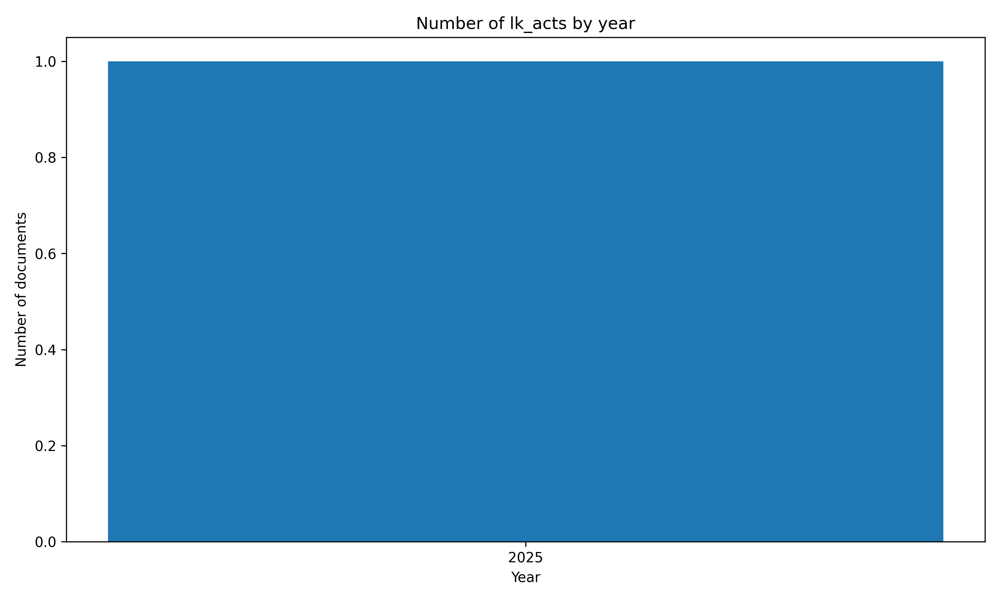

# ⚖️#SriLanka 🇱🇰 Acts `Dataset`


[https://github.com/nuuuwan/lk_legal_docs/tree/data/data/lk_acts](https://github.com/nuuuwan/lk_legal_docs/tree/data/data/lk_acts)

A legal act in Sri Lanka is a law passed by Parliament that governs rights, duties, economy, and society, shaping daily life and national policy.

- [**1** documents](https://github.com/nuuuwan/lk_legal_docs/tree/data/data/lk_acts) (**1.1 MB**), from **2025-09-10** to **2025-09-10**, scraped from **[https://documents.gov.lk/view/acts/acts_2025.html](https://documents.gov.lk/view/acts/acts_2025.html)**

- In **JSON**, **PDF**, **TXT** & **🤗 Hugging Face**

- In **English**

## 📝 Example Metadata

```json
{
    "doc_type": "lk_acts",
    "doc_id": "2025-09-10-2025-09-10-18-2025-en",
    "num": "2025-09-10-18-2025-en",
    "date_str": "2025-09-10",
    "description": "Presidents\u00c3\u00a2\u00e2\u0082\u00ac\u00e2\u0084\u00a2 Entitlements (Repeal)",
    "url_metadata": "https://documents.gov.lk/view/acts/acts_2025.html",
    "lang": "en",
    "url_pdf": "https://documents.gov.lk/view/acts/2025/9/18-2025_E.pdf",
    "doc_number": "18/2025"
}
```

## Documents By Year



## 🤗 Hugging Face Datasets


- [nuuuwan/lk-acts-docs](https://huggingface.co/datasets/nuuuwan/lk-acts-docs)
- [nuuuwan/lk-acts-chunks](https://huggingface.co/datasets/nuuuwan/lk-acts-chunks)

## 🆕 20 Latest documents

- 2025-09-10 | `2025-09-10-18-2025-en` | Presidents’ Entitlements (Repeal) | [data](https://github.com/nuuuwan/lk_legal_docs/tree/data/data/lk_acts/2020s/2025/2025-09-10-2025-09-10-18-2025-en)

---

### [More Datasets about 🇱🇰 #SriLanka](https://github.com/nuuuwan/lk_datasets)


[](https://opensource.org/licenses/MIT)
