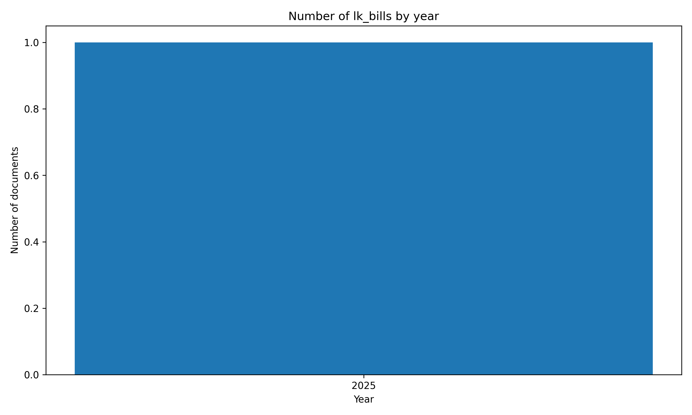

# ⚖️#SriLanka 🇱🇰 Bills `Dataset`


[https://github.com/nuuuwan/lk_legal_docs/tree/data/data/lk_bills](https://github.com/nuuuwan/lk_legal_docs/tree/data/data/lk_bills)

A Bill in Sri Lanka is a draft law proposed in Parliament. It becomes binding once passed and enacted, shaping governance, rights, and daily life in the country.

- [**1** documents](https://github.com/nuuuwan/lk_legal_docs/tree/data/data/lk_bills) (**823.9 kB**), from **2025-09-18** to **2025-09-18**, scraped from **[https://documents.gov.lk/view/bills/bl_2025.html](https://documents.gov.lk/view/bills/bl_2025.html)**

- In **JSON**, **PDF**, **TXT** & **🤗 Hugging Face**

- In **English**

## 📝 Example Metadata

```json
{
    "doc_type": "lk_bills",
    "doc_id": "2025-09-18-2025-09-18-633-2025-en",
    "num": "2025-09-18-633-2025-en",
    "date_str": "2025-09-18",
    "description": "Rent (Repeal) - GS",
    "url_metadata": "https://documents.gov.lk/view/bills/bl_2025.html",
    "lang": "en",
    "url_pdf": "https://documents.gov.lk/view/bills/2025/9/633-2025_E.pdf",
    "doc_number": "633/2025"
}
```

## Documents By Year



## 🤗 Hugging Face Datasets


- [nuuuwan/lk-bills-docs](https://huggingface.co/datasets/nuuuwan/lk-bills-docs)
- [nuuuwan/lk-bills-chunks](https://huggingface.co/datasets/nuuuwan/lk-bills-chunks)

## 🆕 20 Latest documents

- 2025-09-18 | `2025-09-18-633-2025-en` | Rent (Repeal) - GS | [data](https://github.com/nuuuwan/lk_legal_docs/tree/data/data/lk_bills/2020s/2025/2025-09-18-2025-09-18-633-2025-en)

---

### [More Datasets about 🇱🇰 #SriLanka](https://github.com/nuuuwan/lk_datasets)


[](https://opensource.org/licenses/MIT)
