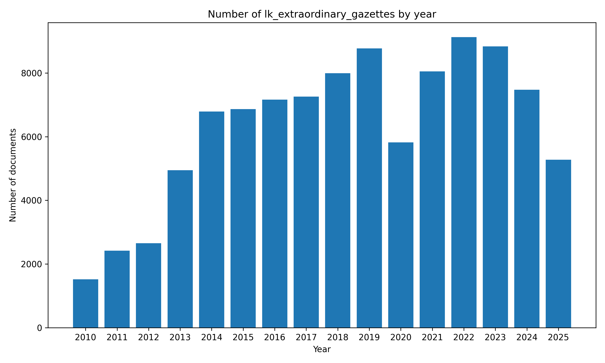

# ⚖️#SriLanka 🇱🇰 Extraordinary Gazettes `Dataset`


[https://github.com/nuuuwan/lk_legal_docs/tree/data/data/lk_extraordinary_gazettes](https://github.com/nuuuwan/lk_legal_docs/tree/data/data/lk_extraordinary_gazettes)

An Extraordinary Gazette is an official government publication used to announce urgent laws, regulations, or public notices with immediate effect.

- [**1** documents](https://github.com/nuuuwan/lk_legal_docs/tree/data/data/lk_extraordinary_gazettes) (**81.1 MB**), from **2025-09-18** to **2025-09-18**, scraped from **[https://documents.gov.lk/view/extra-gazettes/egz_2025.html](https://documents.gov.lk/view/extra-gazettes/egz_2025.html)**

- In **JSON**, **PDF**, **TXT** & **🤗 Hugging Face**

- In **English**

## 📝 Example Metadata

```json
{
    "doc_type": "lk_extraordinary_gazettes",
    "doc_id": "2025-09-18-2025-09-18-2454-54-en",
    "num": "2025-09-18-2454-54-en",
    "date_str": "2025-09-18",
    "description": "Public Service Commission Minute of the Sri Lanka Principals Service 5th Amendemt",
    "url_metadata": "https://documents.gov.lk/view/extra-gazettes/egz_2025.html",
    "lang": "en",
    "url_pdf": "https://documents.gov.lk/view/extra-gazettes/2025/9/2454-54_E.pdf",
    "doc_number": "2454/54"
}
```

## Documents By Year



## 🤗 Hugging Face Datasets


- [nuuuwan/lk-extraordinary-gazettes-docs](https://huggingface.co/datasets/nuuuwan/lk-extraordinary-gazettes-docs)
- [nuuuwan/lk-extraordinary-gazettes-chunks](https://huggingface.co/datasets/nuuuwan/lk-extraordinary-gazettes-chunks)

## 🆕 20 Latest documents

- 2025-09-18 | `2025-09-18-2454-54-en` | Public Service Commission Minute of the Sri Lanka Principals Service 5th Amendemt | [data](https://github.com/nuuuwan/lk_legal_docs/tree/data/data/lk_extraordinary_gazettes/2020s/2025/2025-09-18-2025-09-18-2454-54-en)

---

### [More Datasets about 🇱🇰 #SriLanka](https://github.com/nuuuwan/lk_datasets)


[](https://opensource.org/licenses/MIT)
